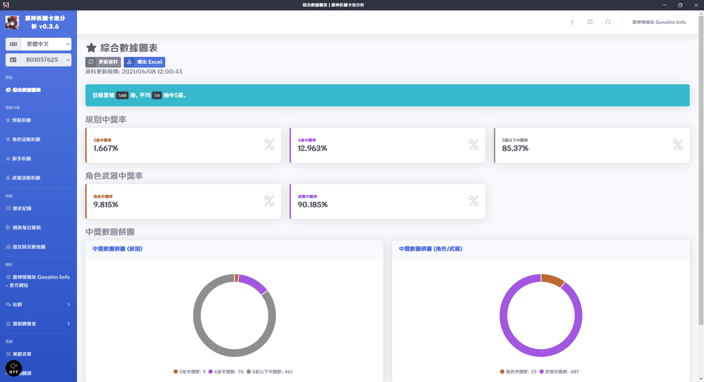
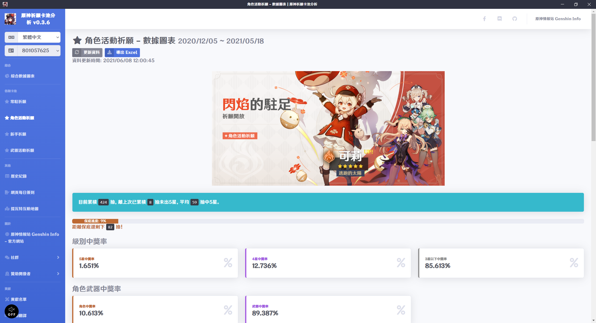
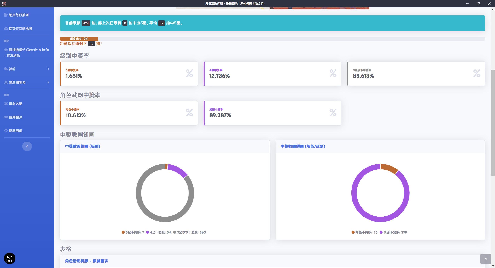
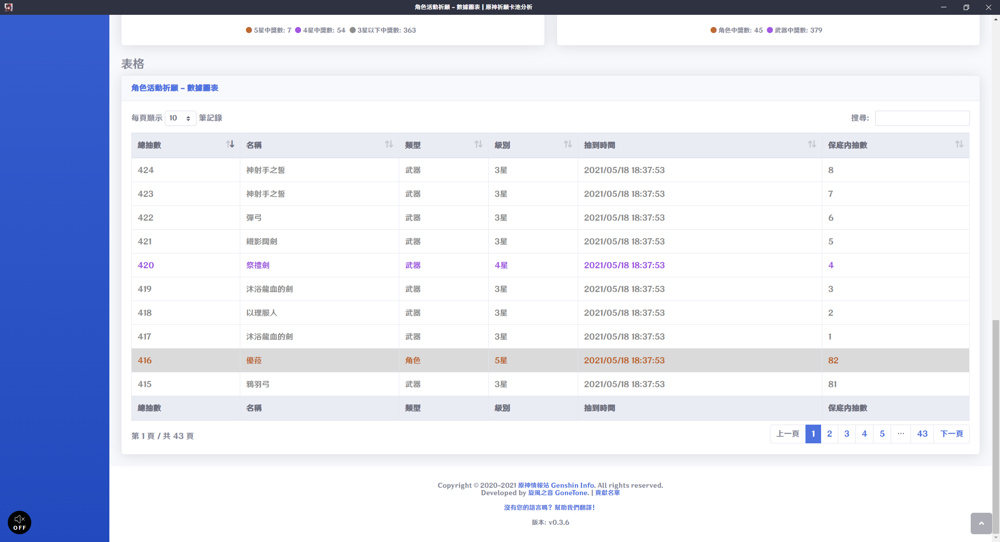
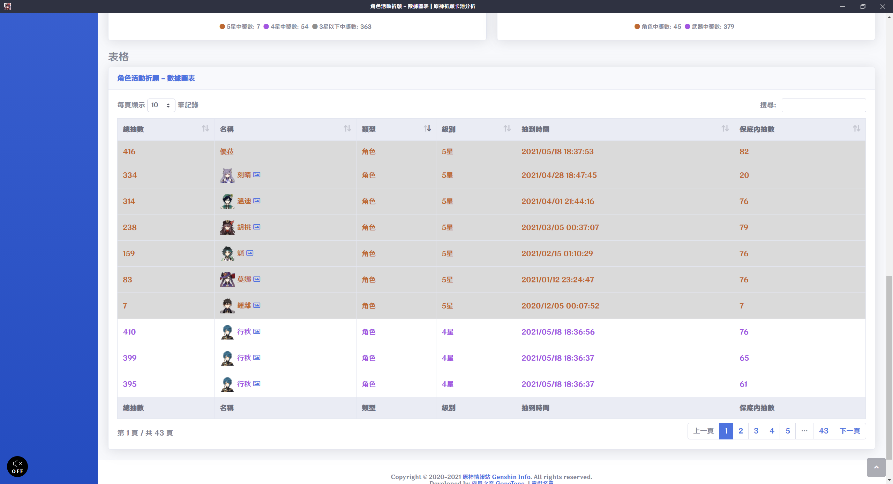
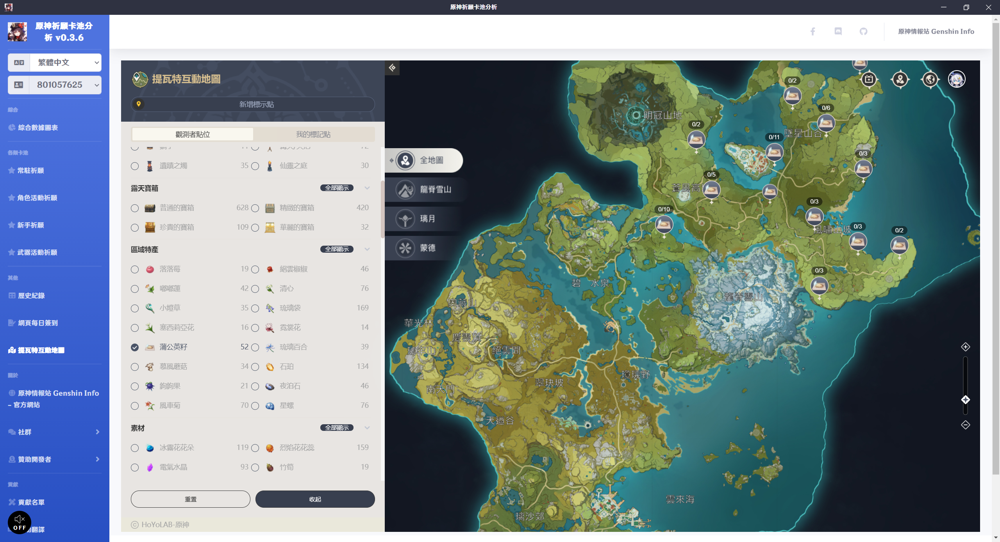

# 原神祈願卡池分析 Genshin Impact Wish Gacha Analyzer

繁體中文 | [简体中文](README_ZH-CN.md) | [English](README_EN.md)

[](https://crowdin.com/project/genshin-impact-wish-gacha-analyzer)

## 通知：本人於 3/14 被抓去服兵役，役期 4 個月，軟體內的當期卡池圖片和音樂無法即時更新，但還是可以使用 (除非遊戲官方又改了什麼)，請見諒。

我開發了一套用來分析祈願卡池歷史記錄的軟體，一開啟各種數據清清楚楚，不用再手動計算啦！

本軟體原理是讀取原神遊戲 Web Cache 檔案取得卡池歷史記錄頁面網址，所以要先在遊戲內開啟過卡池歷史記錄才能讀取到，取得網址後拆解參數，參數會用於 miHoYo 原神相關的 API。

第一次開啟時會加載您的卡池歷史資料，這可能需要一些時間，完成後會將資料存放在您的電腦內，這樣下次開啟軟體時就不用再花時間等待資料加載了，但要取得新資料要按下更新資料才會更新，如果版本更新了會自動重新加載資料。

請放心：本軟體不會竄改任何遊戲檔案和數據，所以不會有被封鎖帳號的風險。如果有被封號，請思考您是不是其他原因被封鎖，不要怪罪我們。

文章：
- 巴哈姆特：<https://forum.gamer.com.tw/C.php?bsn=36730&snA=11990&tnum=4>
- HoYoLAB：<https://www.hoyolab.com/genshin/article/552176>

## 多國語言

請協助我們將軟體翻譯成各國語言！

<https://crwd.in/genshin-impact-wish-gacha-analyzer>

## 下載軟體

軟體在安裝或執行時有可能會被防毒軟體阻擋。如果無法正常執行，請嘗試關閉防毒軟體後再執行看看，本軟體保證無毒。

<https://github.com/GoneTone/genshin-impact-wish-gacha-analyzer/releases>

## 功能和待做事項

- [x] 支援原神 3.0 版本
- [x] 支援國際服
- [ ] 支援中國服
- [x] 總抽數統計
- [x] 中5星平均抽數統計
- [x] 保底進度條及剩餘抽數統計
- [x] 級別中獎率和中獎數統計
- [x] 角色武器中獎率和中獎數統計
- [x] 級別中獎數圓餅圖
- [x] 角色武器中獎數圓餅圖
- [x] 歷史記錄 (官方 API 資料) 表單 (可自訂排序及搜尋)
- [x] 將抽卡記錄導出 Excel
- [x] 依據玩家語言讀取官方 API 取得相對語言資料
- [x] 原神角色圖像查看
- [x] 版本更新通知
- [x] 多國語言 ([協助翻譯](https://crwd.in/genshin-impact-wish-gacha-analyzer))
- [ ] 多帳號記錄切換
- [ ] 記錄和分析結果分享至線上
- [ ] 黑暗模式主題
- [X] 網頁簽到頁面
- [X] 提瓦特互動地圖
- [ ] 資料更新不覆蓋舊資料
- [ ] 資料備份導出導入 (手動)
- [ ] 登入 miHoYo 帳號取得 Cookie (用於處理需要 Cookie 驗證的 API)
- [ ] 整合查詢 創世結晶、原石、聖遺物、武器 獲得/消耗記錄 和 樹脂 消耗記錄

## 截圖









## 開發

### 安裝依賴套件

```bash
npm install
```

### 編譯並執行 (開發)

```bash
npm run electron:serve
```

### 編譯並最小化 (生產)

#### ia32 和 x64

```bash
npm run electron:build:win
```

#### ia32

```bash
npm run electron:build:win32
```

#### x64

```bash
npm run electron:build:win64
```
