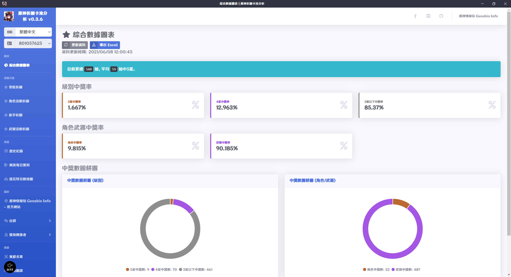
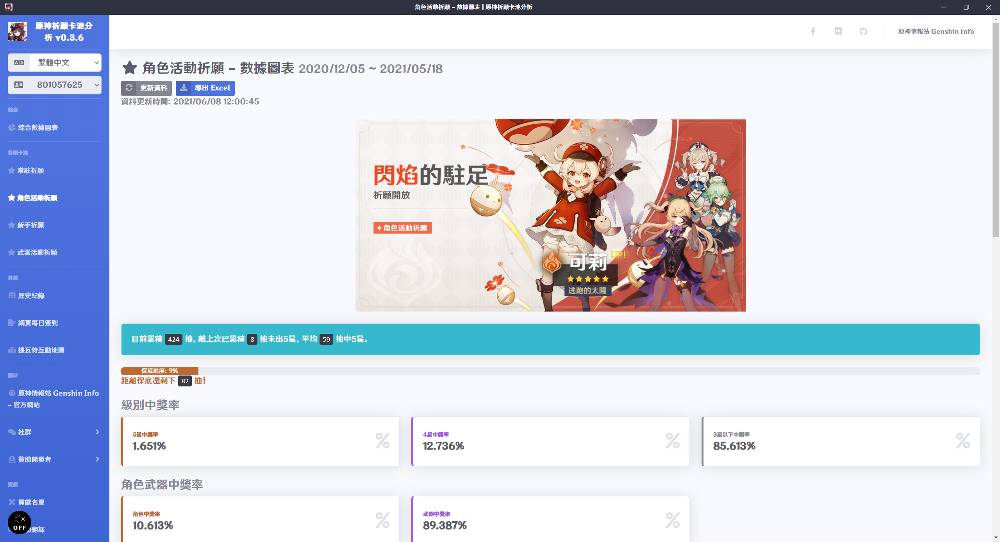
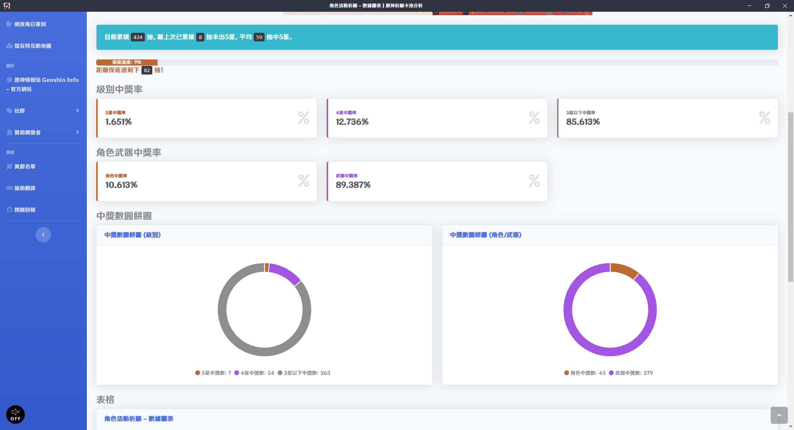
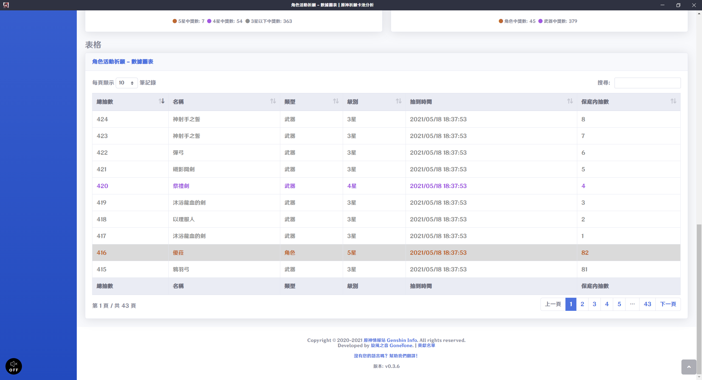
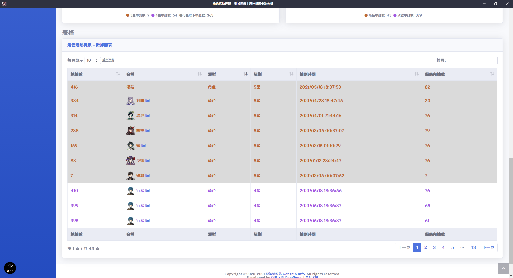
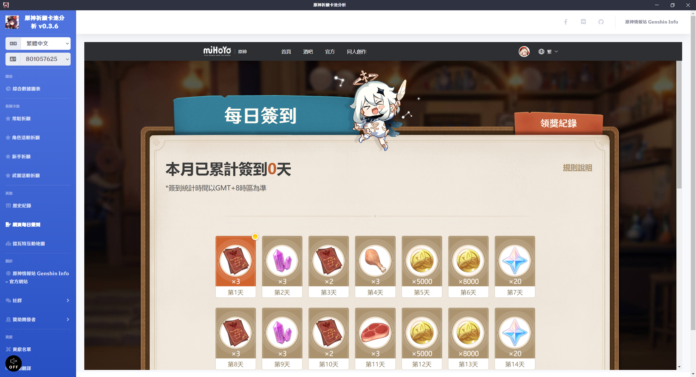
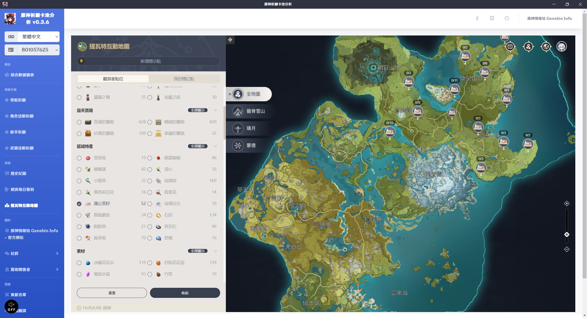

# 原神祈願卡池分析 Genshin Impact Wish Gacha Analyzer

繁體中文 | [简体中文](README_ZH-CN.md) | [English](README_EN.md)

[](https://crowdin.com/project/genshin-impact-wish-gacha-analyzer)

我開發了一套用來分析祈願卡池歷史記錄的軟體，一開啟各種數據清清楚楚，不用再手動計算啦！

本軟體原理是按下「更新資料」後會在本機啟動一個只跑在您電腦上的代理伺服器，並自動安裝一張本機產生的根憑證，藉此攔截原神 webview 對 miHoYo 卡池歷史 API 的請求，所以要在按下更新後再到遊戲內開啟卡池歷史記錄才能攔到，取得網址後拆解參數，參數會用於 miHoYo 原神相關的 API。

第一次按下「更新資料」會加載您完整的卡池歷史，這可能需要一些時間，完成後會將資料存放在您的電腦內，這樣下次開啟軟體就不用再花時間等待資料加載。之後想取得新資料按一下「更新資料」即可，軟體會記住先前攔到的網址，能用就直接用、不用每次重新攔截；如果認證過期，軟體會請您再到遊戲開一次卡池歷史頁面以重新取得網址。

請放心：本軟體不會讀取或竄改任何遊戲檔案、記憶體與遊戲傳輸的資料，只會在 webview 開啟卡池歷史頁面時攔下那一條請求網址，所以不會有被封鎖帳號的風險。如果有被封號，請思考您是不是其他原因被封鎖，不要怪罪我們。

文章：
- 巴哈姆特：<https://forum.gamer.com.tw/C.php?bsn=36730&snA=11990&tnum=4>
- HoYoLAB：<https://www.hoyolab.com/genshin/article/552176>

## 多國語言

請協助我們將軟體翻譯成各國語言！

<https://crowdin.com/project/genshin-impact-wish-gacha-analyzer>

## 下載軟體

軟體在安裝或執行時有可能會被防毒軟體阻擋。原因是本軟體會自行產生並安裝一張本機根憑證、並在按下更新時短暫設置系統代理以攔截原神 webview 的卡池歷史請求──這類行為與惡意程式相似，但本軟體只攔截 `*.hoyoverse.com/getGachaLog` 這一條 API，且憑證只留在您的電腦。如果無法正常執行，請嘗試關閉防毒軟體後再執行看看，本軟體保證無毒。

<https://github.com/GoneTone/genshin-impact-wish-gacha-analyzer/releases>

## 使用方式

1. 啟動原神，先別開啟卡池歷史頁面。
2. 開啟本軟體並按下「更新資料」，軟體會在背景啟動本機代理伺服器並等候攔截。
3. 切回遊戲，到「祈願 → 歷史記錄」開啟卡池歷史頁面。
4. 軟體攔到網址後會自動關閉代理、還原系統代理設定並開始抓取資料；之後想再更新只要重複步驟 2，網址未過期就會直接套用。

## 功能和待做事項

- [x] 支援國際服
- [ ] 支援中國服
- [x] 總抽數統計
- [x] 中5星平均抽數統計
- [x] 保底進度條及剩餘抽數統計
- [x] 級別中獎率和中獎數統計
- [x] 角色武器中獎率和中獎數統計
- [x] 級別中獎數圓餅圖
- [x] 角色武器中獎數圓餅圖
- [x] 歷史記錄 (官方 API 資料) 表單 (可自訂排序及搜尋)
- [x] 將抽卡記錄導出 Excel
- [x] 依據玩家語言讀取官方 API 取得相對語言資料
- [x] 版本更新通知
- [x] 多國語言 ([協助翻譯](https://crowdin.com/project/genshin-impact-wish-gacha-analyzer))
- [x] 多帳號記錄切換
- [ ] 記錄和分析結果分享至線上
- [ ] 黑暗模式主題
- [x] 網頁簽到頁面
- [x] 提瓦特互動地圖
- [x] 資料更新不覆蓋舊資料
- [ ] 資料備份導出導入 (手動)

## 截圖









## 開發

### 前置需求

- 目前僅支援 Windows
- [Flutter SDK](https://docs.flutter.dev/install)（最新穩定版）
- [Rust toolchain](https://rustup.rs/)（stable）
- 執行 `flutter doctor`，依提示補齊缺少的工具

### 取得原始碼並安裝依賴

```bash
git clone https://github.com/GoneTone/genshin-impact-wish-gacha-analyzer.git
cd genshin-impact-wish-gacha-analyzer
flutter pub get
cargo build --manifest-path rust/Cargo.toml
```

### 開發模式執行

```bash
flutter run -d windows
```

### Rust ↔ Dart 橋接程式碼產生

修改 `rust/src/api/` 內的 Rust 函式後，重新產生橋接程式碼。第一次使用前先安裝 codegen 工具：

```bash
cargo install flutter_rust_bridge_codegen
```

之後每次修改 API 都執行：

```bash
flutter_rust_bridge_codegen generate
```

產生的檔案位於 `lib/src/rust/`。

### 編譯生產版

```bash
flutter build windows --release
```

輸出：`build\windows\x64\runner\Release\`

### 執行測試

```bash
flutter test
cargo test --manifest-path rust/Cargo.toml
```
