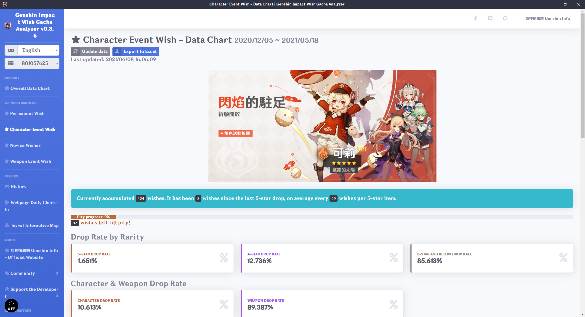
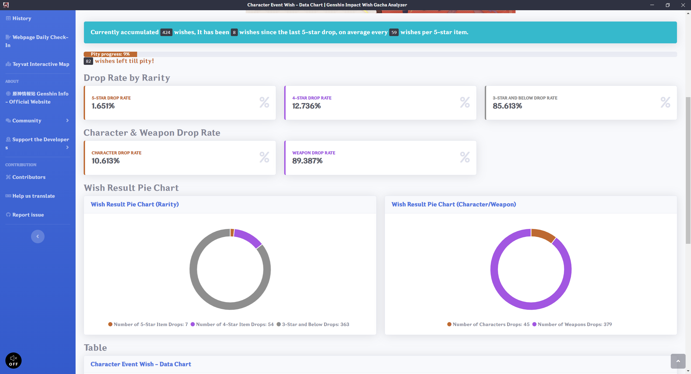
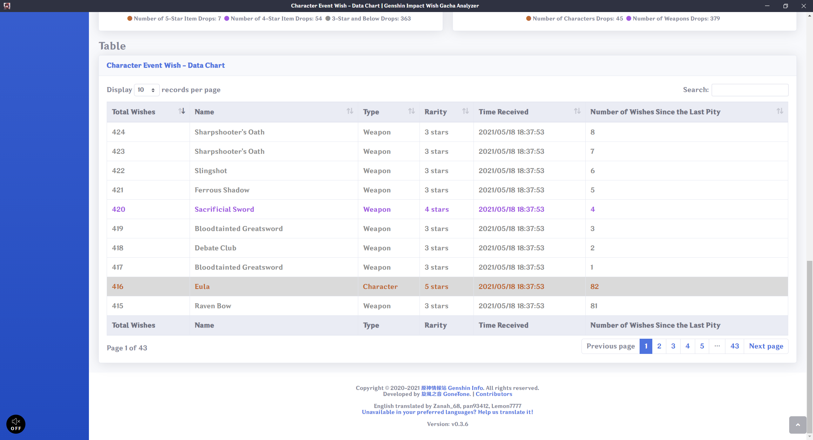
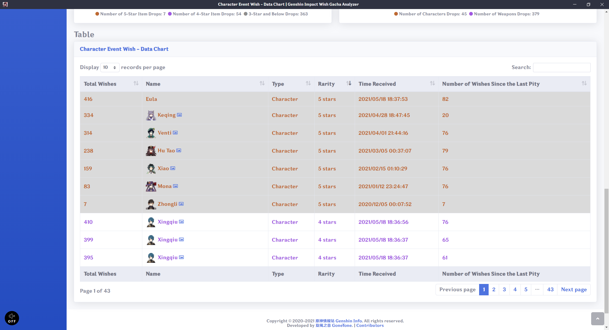
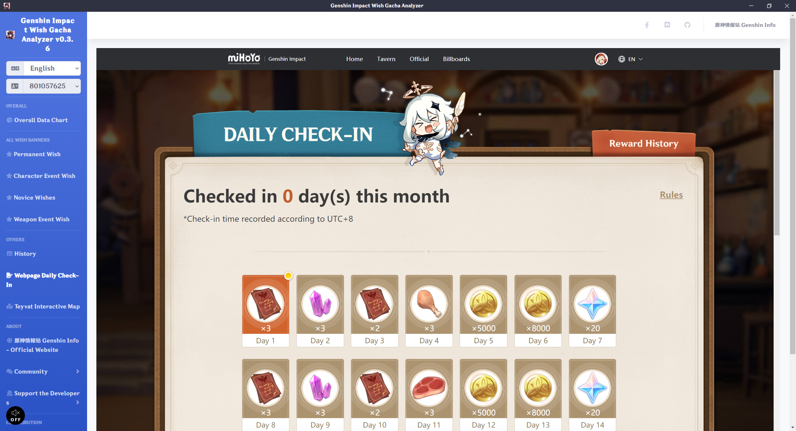
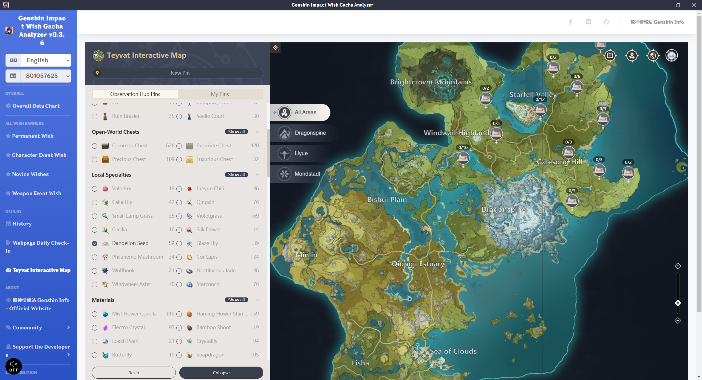

# 原神祈願卡池分析 Genshin Impact Wish Gacha Analyzer

[繁體中文](README.md) | [简体中文](README_ZH-CN.md) | English

[](https://weblate.reh.tw/engage/genshin-impact-wish-gacha-analyzer/)

I have developed a utility for analyzing gacha history, where all data and numbers are well-organized in a convenient manner.
 
It works by reading game lots to obtain the wish history website. Thus, you must start the game and open the wish history page at least once before running this utility.

Variables retrieved from the website will be analyzed and used in an API related to Genshin Impact (from miHoYo).
 
This program loads your gacha history during initial startup, which may take a while. The resulting data will be stored locally to ensure it not take that much time in the next start, after which it will not be updated until you update it manually. The data will also be automatically updated when there is a version update.
 
This program does not tamper with any game resources; thus, there is no risk of being banned for using this software. If you have been banned, it was likely for a different reason. Please do not blame us, thanks.

The original post on Bahamut (巴哈姆特): <https://forum.gamer.com.tw/C.php?bsn=36730&snA=11990&tnum=4>
 
## Multiple Language
 
Please help us translate this software.
 
[](https://weblate.reh.tw/engage/genshin-impact-wish-gacha-analyzer/)
 
## Download Software
 
The software may trigger anti-virus software during installation and execution. If the software doesn't function correctly, please try disabling any anti-virus software you have installed. We guarantee this software is safe and virus-free.

<https://github.com/GoneTone/genshin-impact-wish-gacha-analyzer/releases>

## Functions & To-do List

- [x] Support The International Server
- [ ] Support The CN Server
- [x] Total Wish Counter
- [x] Average Wishes per 5-star Drop Calculator
- [x] Pity Progress Bar and Remaining Wish Counter
- [x] Drop Rate By Rarity and Drop Counter
- [x] Characters/Weapons Drop Rate and Drop Counter
- [x] Rare Drops Pie-chart
- [x] Characters/Weapons Drops Pie-chart
- [x] Record History From The Official API (Allow Custom Ordering and Search)
- [x] Export the Record to Excel
- [x] Load The According Language Data Form The Official API by Local User's Language
- [x] View Character Image
- [x] Software Update Notification
- [x] Multi-language ([Help us traslate!](https://weblate.reh.tw/engage/genshin-impact-wish-gacha-analyzer/))
- [ ] Switching Between Multi-accounts' records
- [ ] Share The Record and Analyzed Result Online
- [ ] Dark mode
- [X] Daily Check-in Webpage
- [X] Teyvat Interactive Map
- [ ] Update Data Without Overwriting The Original Data
- [ ] Export and Import Data Back-ups (Manual)
- [ ] Log in to your miHoYo account to get the Cookies (for API that require Cookie authentication)

## Screenshot









## Development

### Install Packages

```bash
npm install
```

### Compile and Run (For Development Use)

```bash
npm run electron:serve
```

### Compile and Minify (For Production Use)

#### ia32 and x64

```bash
npm run electron:build:win
```

#### ia32

```bash
npm run electron:build:win32
```

#### x64

```bash
npm run electron:build:win64
```
