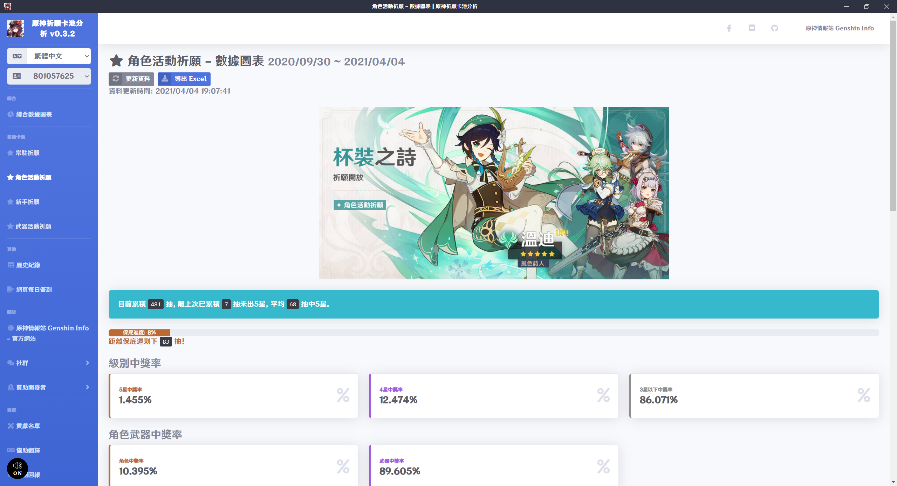

# 原神祈願卡池分析 Genshin Impact Wish Gacha Analyzer

[繁體中文](README.md) | [简体中文](README_ZH-CN.md) | English

[](https://weblate.reh.tw/engage/genshin-impact-wish-gacha-analyzer/)

I developed a software to analyze the gacha history, all data and numbers are well organized, let your hand go free without the dizzialing calculations!

This software works by reading the Log files in the game to get the wish history website, therefore you have to start the game and open the wish history page for at least once before you run the programme for it to fuction correctly. The variables in the website retrieved will be broken down and used in GenShin Impact(from miHoYo)-related API

The software will load your Gacha history during the initial start, this process may took a while, the loaded data will be saved in the local so it does not take that much time in the next start. The retrieved data will not be updated untill you update it Manually. The data will also be automatically updated when there is a version-update.

Disclaimer: This Software does NOT tamper with any game file and data, there is no risk of getting banned by using this software. If you got banned, please kindly consider if you had other factor that got you banned, please do not blame on us, thank you

The Origin Post On Bahamut (巴哈姆特): <https://forum.gamer.com.tw/C.php?bsn=36730&snA=11990&tnum=4>

## Multiple Language

Please help us translate this software into variety of language!

[](https://weblate.reh.tw/engage/genshin-impact-wish-gacha-analyzer/)

## Download Software

The software may get blocked by the anti-virus software during the installation and execution process. If the software cannot funtion correctly, please try disablling the anti-virus and run again, we promise this software is virus-free.

[https://github.com/GoneTone/genshin-impact-wish-gacha-analyzer/releases](https://github.com/GoneTone/genshin-impact-wish-gacha-analyzer/releases)

## Funstions & To-do List

- [x] Support The International Server
- [ ] Support The CN Server
- [x] Total Wish Counter
- [x] Average Wishes per 5-star Drop Calculator
- [x] Pity Progress Bar and Remaining Wish Counter
- [x] Drop Rate By Rarity and Drop Counter
- [x] Characters/Weapons Drop Rate and Drop Counter
- [x] Rare Drops Pie-chart
- [x] Characters/Weapons Drops Pie-chart
- [x] Record History From The Official API(Allow Custom Ordering and Search)
- [x] Export the Recored to Excel
- [x] Load The According Language Data Form The Official API by Local User's Language
- [x] View Character Image
- [x] Software Update Notification
- [x] Multi-language ([Help us traslate!](https://weblate.reh.tw/engage/genshin-impact-wish-gacha-analyzer/))
- [ ] Switching Between Multi-accounts' records
- [ ] Share The Record and Analyzed Result Online
- [ ] Dark mode
- [X] Daily Check-in Webpage
- [X] Teyvat Interactive Map
- [ ] Update Data Without Overwriting The Original Data
- [ ] Export and Import Data Back-ups (Manual)

## Screenshot 





## Development

### Installation Packages

```bash
npm install
```

### Compile and Execute (For Development Use Only)

```bash
npm run electron:serve
```

### Compile and Minimized (For Production Use Only)

#### ia32 and x64

```bash
npm run electron:build:win
```

#### ia32

```bash
npm run electron:build:win32
```

#### x64

```bash
npm run electron:build:win64
```
