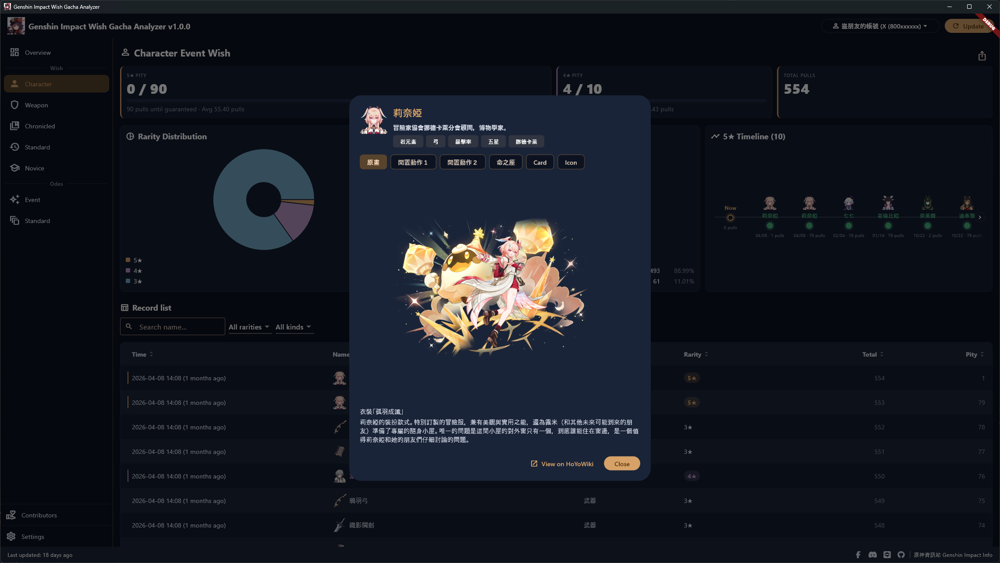

# 原神祈願卡池分析 Genshin Impact Wish Gacha Analyzer

[繁體中文](README.md) | [简体中文](README_ZH-HANS.md) | English | [日本語](README_JA-JP.md)

[](https://crowdin.com/project/genshin-impact-wish-gacha-analyzer)

I have developed a utility for analyzing gacha history, where all data and numbers are well-organized in a convenient manner.

When you press *Update*, the utility starts a local proxy server (running only on your computer) and automatically installs a locally generated root certificate, so it can intercept Genshin Impact's WebView request to the miHoYo wish history API. You therefore need to open the wish history page in the game *after* pressing *Update*, so the request can be captured. The captured URL is parsed and the resulting parameters are used to call miHoYo's API.

The first time you press *Update*, the utility loads your full gacha history, which may take a while. The data is then stored locally so you don't have to wait again on the next launch. To pull new records, just press *Update*: the utility remembers the previously captured URL and reuses it as long as it's still valid, so you don't have to repeat the capture every time. If the captured URL has expired, the utility will ask you to open the wish history page in the game again to re-capture.

Rest assured: this utility does not read or modify any game file, game memory, or in-game network traffic. It only intercepts the wish history page request that the in-game WebView itself makes, so there is no risk of being banned for using it. If you have been banned, it was likely for a different reason. Please do not blame us, thanks.

Posts:
- 巴哈姆特 (Bahamut): <https://forum.gamer.com.tw/C.php?bsn=36730&snA=11990>
- HoYoLAB: <https://www.hoyolab.com/genshin/article/552176>
- 原神資訊站 (Genshin Impact Info): <https://genshininfo.reh.tw/archives/97>
 
## Multiple Language
 
Please help us translate this software.
 
<https://crowdin.com/project/genshin-impact-wish-gacha-analyzer>
 
## Download Software
 
The utility may trigger anti-virus software during installation and execution. This is because it generates and installs a local root certificate, and briefly configures a system proxy when you press *Update* to intercept the in-game WebView's wish history request — behavior that resembles malware. However, the utility only intercepts the `getGachaLog` (Wish) and `getBeyondGachaLog` (Odes) wish-history endpoints on `*.hoyoverse.com`, and the certificate stays on your computer. If the utility doesn't function correctly, please try disabling any anti-virus software you have installed. We guarantee this utility is safe and virus-free.

<https://github.com/GoneTone/genshin-impact-wish-gacha-analyzer/releases>

### Versions for Other Games

- Wuthering Waves: <https://github.com/GoneTone/wuthering-waves-convene-gacha-analyzer>
- More games may be supported in the future...

## How to Use

1. Launch Genshin Impact (don't open the wish history page yet).
2. Open this utility and press *Update*. The utility will start a local proxy server in the background and wait for the request.
3. Switch back to the game and open *Wish → History* to view the wish history page.
4. Once captured, the utility automatically shuts down the proxy, restores your system proxy settings, and starts fetching your data. To update again later, just repeat step 2 — the captured URL will be reused if still valid.

## Features

- Auto-intercepts the in-game WebView's request to the miHoYo wish history API via a local proxy and a self-signed root certificate — no need to paste URLs by hand
- Supports the Global server (CN server not supported yet)
- Covers all 7 gacha types: Character Event Wish, Weapon Event Wish, Chronicled Wish, Standard Wish, Beginners' Wish, Event Odes, Standard Odes
- Multi-account (UID) management: custom aliases, drag-to-reorder, one-click switching
- Incremental updates merge new records without overwriting old ones, so entries that fall off the official history won't disappear
- Total pulls and 5★ / 4★ / 3★ / 2★ counts with their share of the total
- Dual pity progress (5★ and 4★) showing remaining pulls until pity
- Average pulls per 5★ / 4★ hit (per-banner and overall)
- Per-gacha 5★ timeline
- 5★ overview: every distinct 5★ you've pulled laid out in a row, each with a cumulative count badge and clickable for details — shown on each banner page, the overview page, and the share image
- Bar chart comparing each gacha's highest-rarity counts
- Rarity distribution pie chart
- Item type distribution pie chart
- Wish history table: multi-column sort, fuzzy search, rarity and item-type filters, pagination
- Auto-fetched character / weapon icons and details (from [HoYoWiki](https://wiki.hoyolab.com/pc/genshin/home)): shown in the history table and timelines; click an item to view official artwork, description, and tags — with a one-click jump to HoYoWiki
- Generate a share image in one click (dark / light theme, full UID or first-3-digits mask), auto-saved and copied to the clipboard
- Export / Import accounts as JSON
- Cloud sync: link your own Google account to automatically back up gacha records to your Google Drive and keep multiple computers in sync; deleting an account can optionally remove it from the cloud data too
- Dark / Light theme toggle
- Multi-language ([help us translate](https://crowdin.com/project/genshin-impact-wish-gacha-analyzer))
- Optional UID masking in the UI (first 3 digits only) for added privacy
- Automatic update check on launch, with a manual trigger in Settings
- All data stays on your machine by default — nothing is uploaded; cloud sync is opt-in and backs up only to your own Google Drive

## Screenshot




## Development

### Prerequisites

- Windows only for now
- [Flutter SDK](https://docs.flutter.dev/install) (latest stable)
- [Rust toolchain](https://rustup.rs/) (stable)
- Run `flutter doctor` and install anything it flags as missing

### Clone and install dependencies

```bash
git clone https://github.com/GoneTone/genshin-impact-wish-gacha-analyzer.git
cd genshin-impact-wish-gacha-analyzer
flutter pub get
```

Rust is compiled automatically by `rust_builder/`'s cargokit during `flutter run` / `flutter build`; no manual `cargo build` is needed (the Rust toolchain must be installed first).

### Run in development mode

```bash
flutter run -d windows
```

### Cloud sync credentials (optional)

Cloud sync (Google Drive backup) requires Google OAuth credentials. Without them everything else works normally; the cloud sync section in Settings simply shows an "unconfigured" notice.

To enable it in your own build:

1. In the [Google Cloud Console](https://console.cloud.google.com/), create a project, enable the **Google Drive API**, configure the OAuth consent screen (scopes: `.../auth/drive.appdata` and `email`), and create a **Desktop app** OAuth client.
2. Create `secrets/cloud_sync_defines.json` at the project root (git-ignored):

   ```json
   {
     "CLOUD_SYNC_CLIENT_ID": "your client id",
     "CLOUD_SYNC_CLIENT_SECRET": "your client secret"
   }
   ```

3. Pass the file when running (JetBrains IDEs can use the bundled "main.dart (cloud sync)" run configuration; `build_release.ps1` picks the file up automatically when packaging):

   ```bash
   flutter run -d windows --dart-define-from-file=secrets/cloud_sync_defines.json
   ```

### Rust ↔ Dart bridge code generation

After changing Rust functions in `rust/src/api/`, regenerate the bridge code. Install the codegen tool on first use:

```bash
cargo install flutter_rust_bridge_codegen --version 2.12.0
```

Then run this whenever the API changes:

```bash
flutter_rust_bridge_codegen generate
```

Generated files live in `lib/src/rust/`.

### Build for release

```bash
flutter build windows --release
```

Output: `build\windows\x64\runner\Release\`

### Run tests

```bash
flutter test
cargo test --manifest-path rust/Cargo.toml
```
