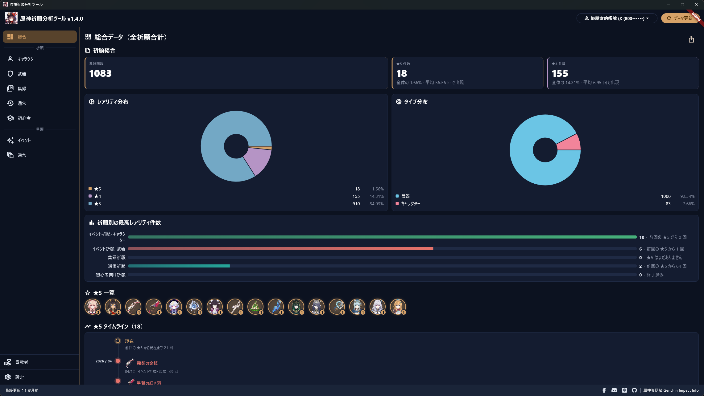
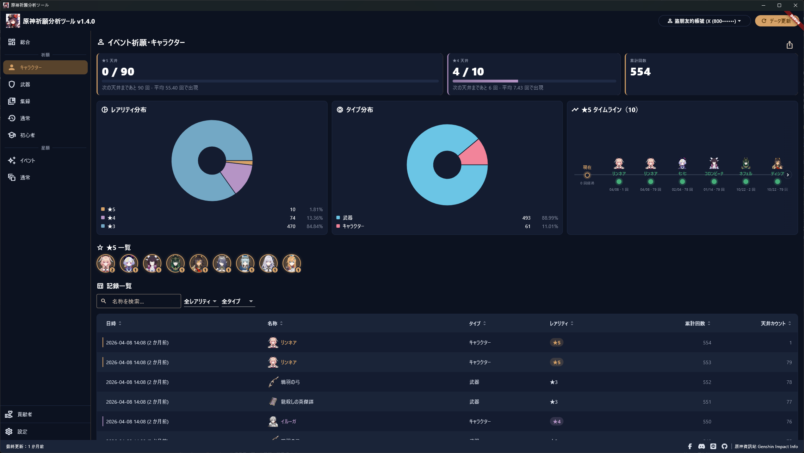
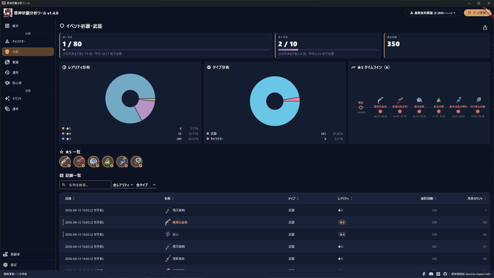
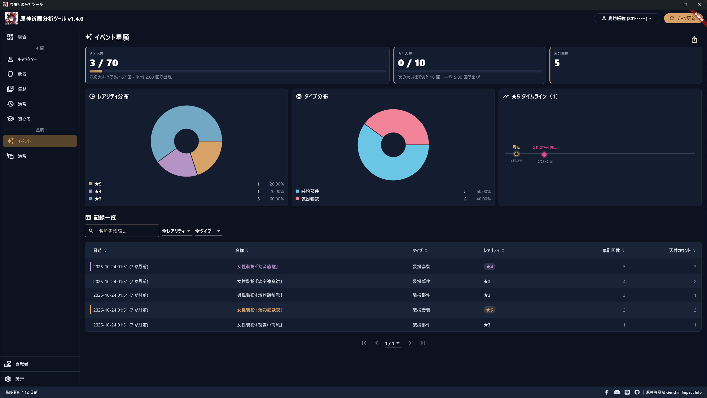
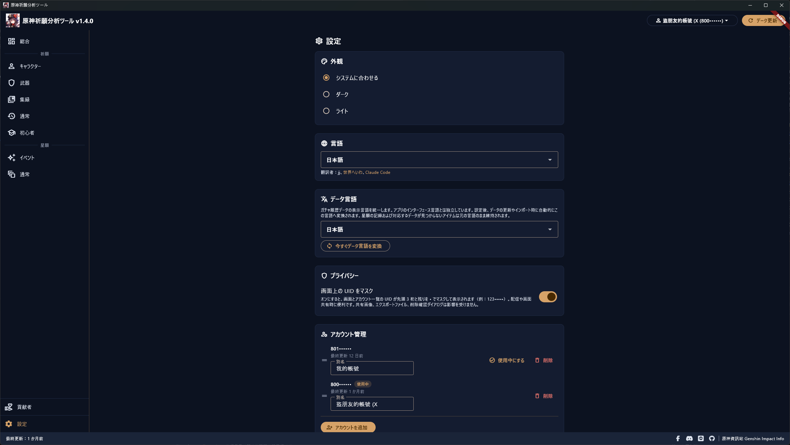
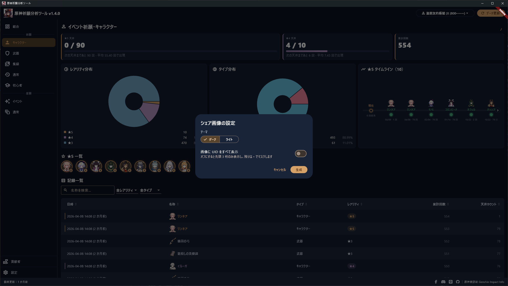
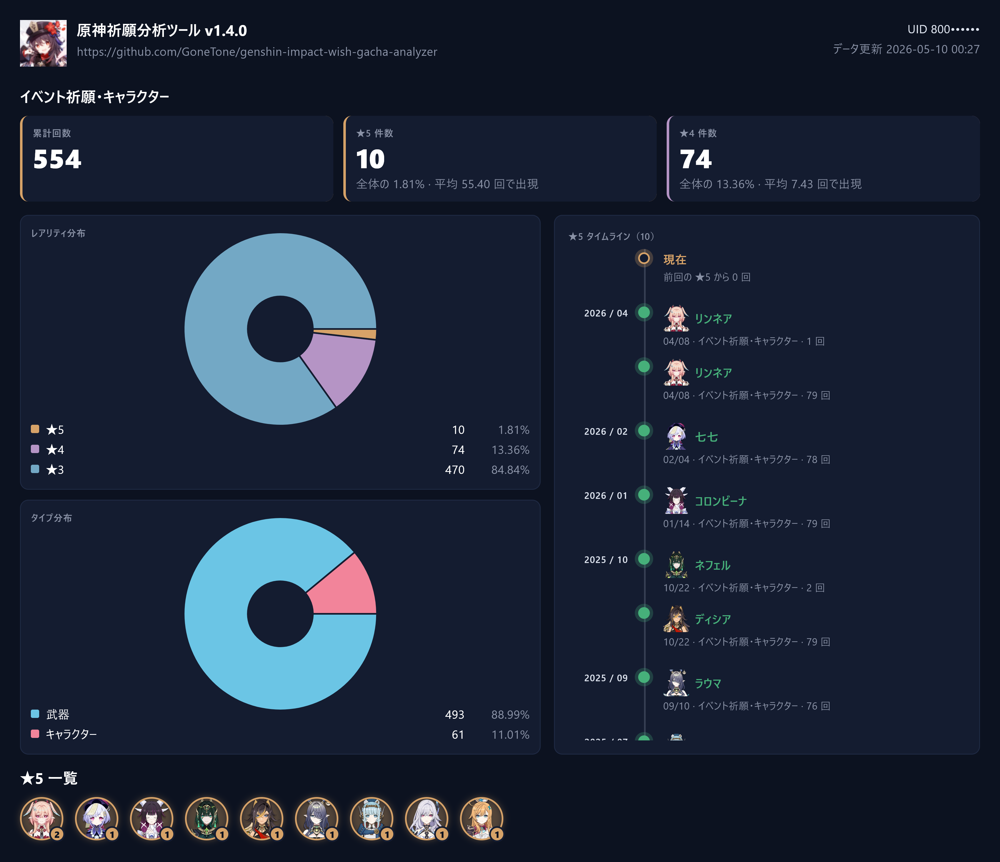
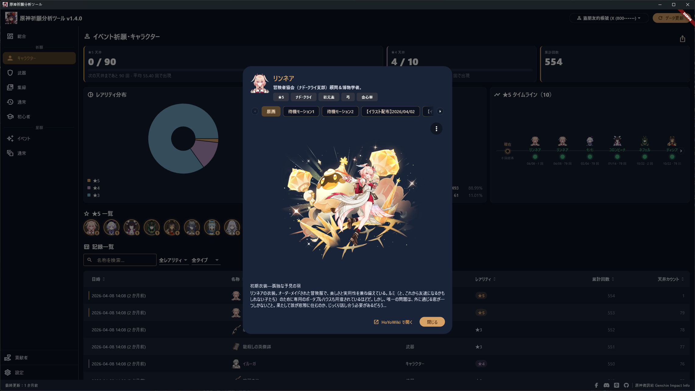

# 原神祈願分析ツール Genshin Impact Wish Gacha Analyzer

[繁體中文](README.md) | [简体中文](README_ZH-HANS.md) | [English](README_EN.md) | 日本語

[](https://crowdin.com/project/genshin-impact-wish-gacha-analyzer)

祈願の履歴を分析するためのソフトを開発しました。起動するだけで各種データがひと目でわかり、もう手作業で計算する必要はありません！

本ソフトの仕組みは、「データ更新」を押すとお使いのパソコン上だけで動くローカルプロキシサーバーを起動し、ローカルで生成したルート証明書を自動でインストールすることで、原神の WebView から miHoYo の祈願履歴 API へのリクエストを傍受するというものです。そのため、更新を押したあとにゲーム内で祈願履歴ページを開かないと傍受できません。取得した URL からパラメーターを解析し、そのパラメーターを miHoYo の原神関連 API に利用します。

初めて「データ更新」を押すと祈願履歴をすべて読み込むため、少し時間がかかることがあります。完了するとデータはお使いのパソコン内に保存されるので、次回ソフトを起動したときはデータの読み込みを待つ必要がありません。その後、新しいデータを取得したいときは「データ更新」を押すだけです。本ソフトは以前傍受した URL を記憶しており、有効ならそのまま再利用するので、毎回傍受し直す必要はありません。URL の有効期限が切れている場合は、URL を取得し直すためにゲーム内で祈願履歴ページをもう一度開くようお願いします。

ご安心ください。本ソフトはゲームのファイル・メモリ・ゲームが送受信するデータの読み取りや改ざんを一切行わず、WebView が祈願履歴ページを開いたときにそのリクエスト URL を傍受するだけなので、アカウント停止（BAN）のリスクはありません。もし BAN された場合は、ほかの原因によるものでないかご確認いただき、当方を責めないようお願いいたします。

記事：
- 巴哈姆特 (Bahamut)：<https://forum.gamer.com.tw/C.php?bsn=36730&snA=11990>
- HoYoLAB：<https://www.hoyolab.com/genshin/article/552176>
- 原神資訊站 (Genshin Impact Info)：<https://genshininfo.reh.tw/archives/97>

## 多言語対応

本ソフトを各国の言語へ翻訳するご協力をお願いします！

<https://crowdin.com/project/genshin-impact-wish-gacha-analyzer>

## ソフトのダウンロード

本ソフトはインストールや実行の際に、ウイルス対策ソフトにブロックされることがあります。これは、本ソフトがローカルのルート証明書を自ら生成・インストールし、更新を押した際に原神の WebView の祈願履歴リクエストを傍受するために一時的にシステムプロキシを設定するためで、こうした挙動がマルウェアと似ているからです。ただし、本ソフトが傍受するのは `*.hoyoverse.com` 上の `getGachaLog`（祈願）と `getBeyondGachaLog`（星願）という 2 つの祈願履歴 API のみで、証明書もお使いのパソコン内にしか残りません。正常に動作しない場合は、ウイルス対策ソフトを一度無効にしてから実行してみてください。本ソフトは無害であることを保証します。

<https://github.com/GoneTone/genshin-impact-wish-gacha-analyzer/releases>

### 他のゲームに対応したバージョンもあります

- 鳴潮（Wuthering Waves）：<https://github.com/GoneTone/wuthering-waves-convene-gacha-analyzer>
- 今後、対応ゲームを追加する可能性があります……

## 使い方

1. 原神を起動します（まだ祈願履歴ページは開かないでください）。
2. 本ソフトを開いて「データ更新」を押します。ソフトはバックグラウンドでローカルプロキシサーバーを起動し、傍受を待機します。
3. ゲームに戻り、「祈願 → 履歴」から祈願履歴ページを開きます。
4. URL を傍受すると、ソフトは自動的にプロキシを終了し、システムプロキシ設定を元に戻してデータの取得を開始します。あとで再度更新したいときは手順 2 を繰り返すだけで、URL の有効期限が切れていなければそのまま再利用されます。

## 機能と特徴

- 原神の WebView から miHoYo の祈願履歴 API へのリクエストを（ローカルプロキシサーバーと自己署名ルート証明書により）自動で傍受。URL を手で貼り付ける必要はありません
- グローバルサーバーに対応（中国サーバーは未対応）
- 7 種類の祈願に対応：イベント祈願・キャラクター、イベント祈願・武器、集録祈願、通常祈願、初心者向け祈願、イベント星願、通常星願
- 複数アカウント (UID) の管理：エイリアスのカスタマイズ、ドラッグでの並べ替え、ワンクリック切り替え
- 新旧データを自動で統合し、過去の記録を上書きしません。公式の履歴記録が期限切れになっても消えることはありません
- 総ガチャ回数と ★5 / ★4 / ★3 / ★2 の件数・割合の統計
- ★5 と ★4 の天井プログレスバーを表示し、天井までの残り回数を表示
- ★5 / ★4 の平均排出回数の統計（祈願ごと・全体）
- 祈願ごとの ★5 タイムライン
- ★5 一覧：これまでに引いた重複なしのすべての ★5 を横並びで表示。それぞれに累計回数バッジが付き、クリックで詳細を表示。各祈願ページ・総合データページ・シェア画像のいずれにも表示されます
- 祈願ごとの最高レアリティ件数を比較する棒グラフ
- レアリティ分布の円グラフ
- タイプ分布の円グラフ
- 履歴記録テーブル：複数列ソート、あいまい検索、レアリティと種類によるフィルター、ページネーション
- キャラクター / 武器のアイコンとデータを自動で補完（出典：[HoYoWiki](https://wiki.hoyolab.com/pc/genshin/home)）。テーブルとタイムラインのどちらにもアイコンを表示。アイテムをクリックすると公式イラスト・説明・タグを閲覧でき、HoYoWiki へワンクリックで移動できます
- シェア画像をワンクリックで生成（ダーク / ライトテーマ、UID 全表示または先頭 3 桁のみのマスクを選択可能）。自動で保存され、クリップボードにもコピーされます
- アカウントデータを JSON でエクスポート / インポート
- クラウド同期：ご自身の Google アカウントを連携すると、祈願履歴が自動的に Google ドライブへバックアップされ、複数の PC 間で同期されます。アカウント削除時にクラウドからも削除するよう選択できます
- ダーク / ライトテーマの切り替え
- 多言語対応（[翻訳にご協力ください](https://crowdin.com/project/genshin-impact-wish-gacha-analyzer)）
- 設定で画面上の UID マスク（先頭 3 桁のみ表示）を有効にでき、プライバシーを保護
- 起動時に自動で新バージョンを確認。設定ページから手動で実行することもできます
- すべてのデータは既定でローカルに留まり、アップロードされません。クラウド同期は任意機能で、有効にした場合もご自身の Google ドライブにのみバックアップされます

## スクリーンショット










## 開発

### 前提条件

- 現在は Windows のみ対応
- [Flutter SDK](https://docs.flutter.dev/install)（最新の安定版）
- [Rust toolchain](https://rustup.rs/)（stable）
- `flutter doctor` を実行し、不足しているツールを指示に従って追加してください

### ソースコードの取得と依存関係のインストール

```bash
git clone https://github.com/GoneTone/genshin-impact-wish-gacha-analyzer.git
cd genshin-impact-wish-gacha-analyzer
flutter pub get
```

Rust は `flutter run` / `flutter build` の際に `rust_builder/` の cargokit によって自動でコンパイルされるため、手動での `cargo build` は不要です（ただし事前に Rust toolchain のインストールが必要です）。

### 開発モードでの実行

```bash
flutter run -d windows
```

### クラウド同期の認証情報（任意）

クラウド同期（Google ドライブへのバックアップ）には Google OAuth 認証情報が必要です。未設定でも他の機能には一切影響せず、設定ページのクラウド同期欄に未設定の案内が表示されるだけです。

自分のビルドで有効にするには：

1. [Google Cloud Console](https://console.cloud.google.com/) でプロジェクトを作成し、**Google Drive API** を有効化、OAuth 同意画面を設定（スコープ：`.../auth/drive.appdata` と `email`）し、「**デスクトップ アプリ**」タイプの OAuth クライアントを作成します。
2. プロジェクトルートに `secrets/cloud_sync_defines.json` を作成します（git 管理外）：

   ```json
   {
     "CLOUD_SYNC_CLIENT_ID": "あなたの client id",
     "CLOUD_SYNC_CLIENT_SECRET": "あなたの client secret"
   }
   ```

3. 実行時にこのファイルを渡します（JetBrains IDE では同梱の「main.dart (cloud sync)」実行構成が使えます。`build_release.ps1` はパッケージ時に自動検出します）：

   ```bash
   flutter run -d windows --dart-define-from-file=secrets/cloud_sync_defines.json
   ```

### Rust ↔ Dart のブリッジコード生成

`rust/src/api/` 内の Rust 関数を変更したら、ブリッジコードを再生成します。初回利用前に codegen ツールをインストールしてください：

```bash
cargo install flutter_rust_bridge_codegen --version 2.12.0
```

その後、API を変更するたびに実行します：

```bash
flutter_rust_bridge_codegen generate
```

生成されたファイルは `lib/src/rust/` にあります。

### 本番版のビルド

```bash
flutter build windows --release
```

出力：`build\windows\x64\runner\Release\`

### テストの実行

```bash
flutter test
cargo test --manifest-path rust/Cargo.toml
```
