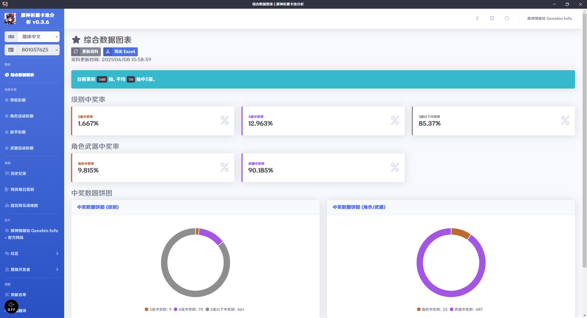
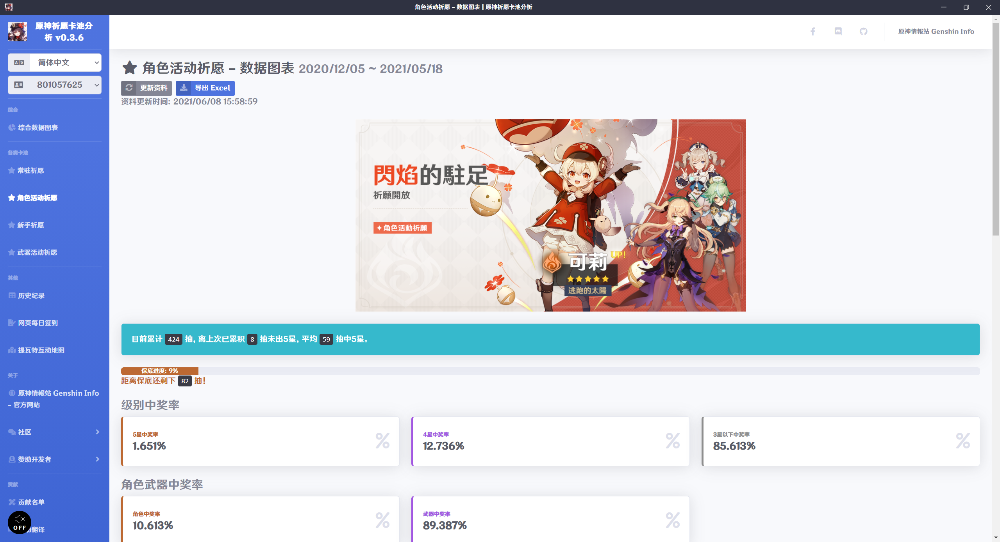
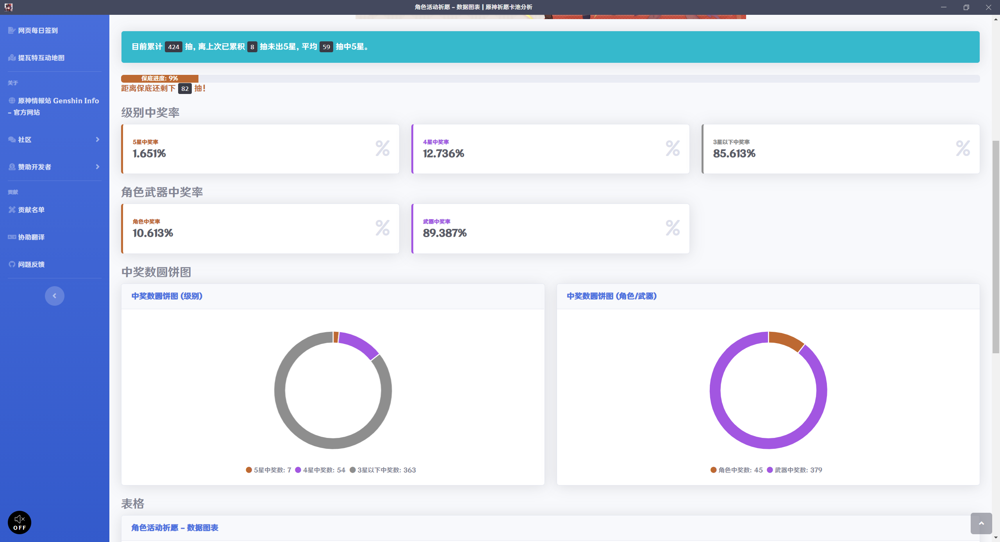
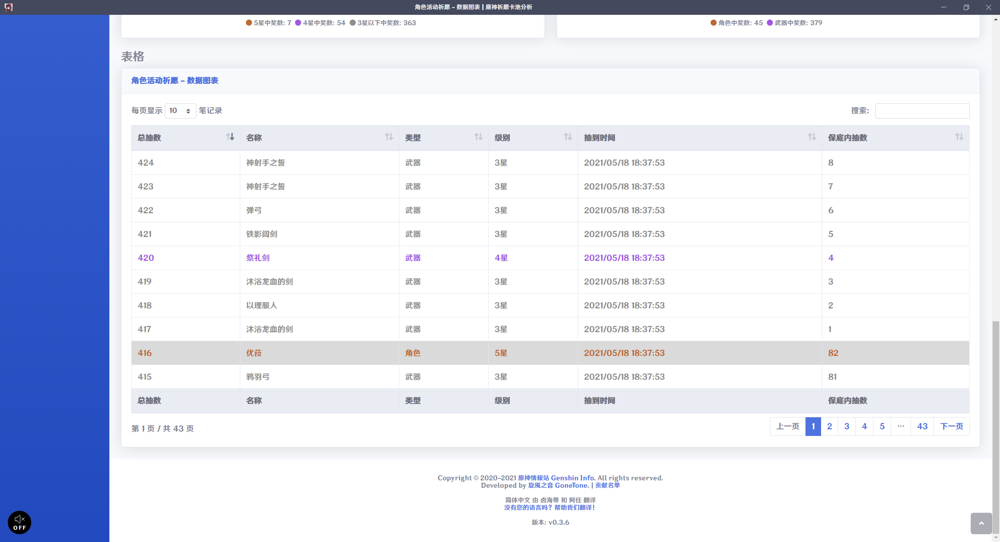
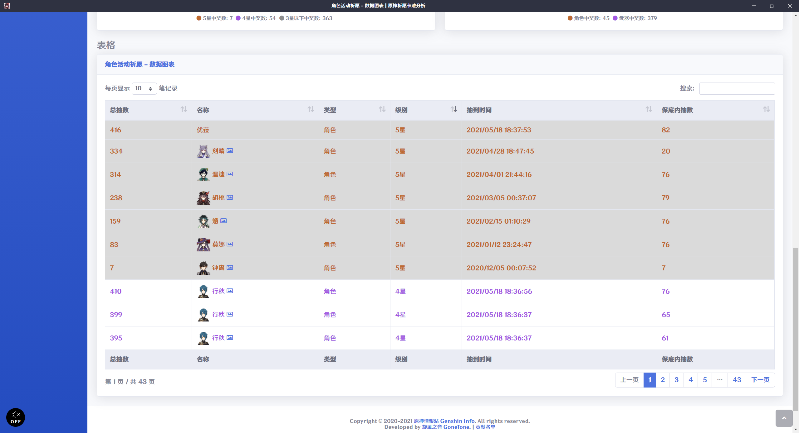
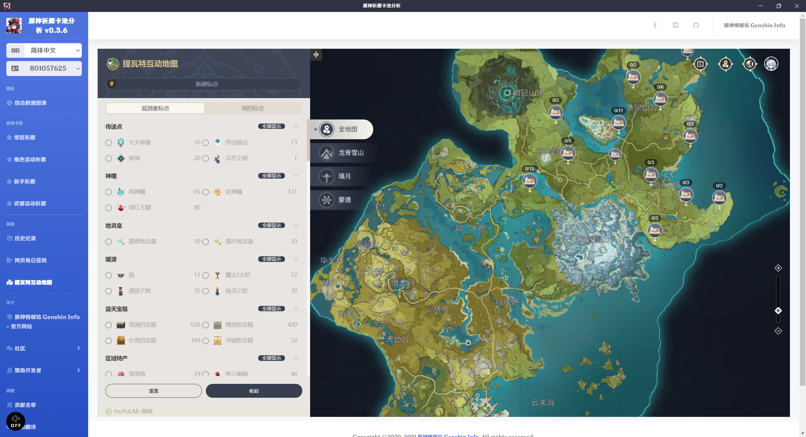

# 原神祈愿卡池分析 Genshin Impact Wish Gacha Analyzer

[繁體中文](README.md) | 简体中文 | [English](README_EN.md)

[](https://weblate.reh.tw/engage/genshin-impact-wish-gacha-analyzer/)

我开发了一套用来分析祈愿卡池历史纪录的软件，一开启各种数据清清楚楚，不用再手动计算啦！

本软件原理是读取原神游戏 Log 文件取得卡池历史纪录页面网址，所以要先在游戏内开启过卡池历史纪录才能读取到，取得网址后拆解参数，参数会用于miHoYo 原神相关的API。

第一次开启时会加载您的卡池历史资料，这可能需要一些时间，完成后会将资料存放在您的电脑内，这样下次开启软件时就不用再花时间等待资料加载了，但要取得新资料要按下更新资料才会更新，如果版本更新了会自动重新加载资料。

请放心：本软件不会窜改任何游戏文件和数据，所以不会有被封锁帐号的风险。如果有被封号，请思考您是不是其他原因被封锁，不要怪罪我们。

帖子：
- 巴哈姆特：<https://forum.gamer.com.tw/C.php?bsn=36730&snA=11990&tnum=4>
- HoYoLAB：<https://www.hoyolab.com/genshin/article/552176>

## 多国语言

请协助我们将软件翻译成各国语言！

[](https://weblate.reh.tw/engage/genshin-impact-wish-gacha-analyzer/)

## 下载软件

软件在安装或运行时有可能会被防毒软件阻挡。如果无法正常运行，请尝试关闭防毒软件后再运行看看，本软件保证无毒。

<https://github.com/GoneTone/genshin-impact-wish-gacha-analyzer/releases>

## 功能和待做事项

- [x] 支持国际服
- [ ] 支持中国服
- [x] 总抽数统计
- [x] 中5星平均抽数统计
- [x] 保底进度条及剩余抽数统计
- [x] 级别中奖率和中奖数统计
- [x] 角色武器中奖率和中奖数统计
- [x] 级别中奖数圆饼图
- [x] 角色武器中奖数圆饼图
- [x] 历史纪录 (官方 API 资料) 表单 (可自订排序及搜索)
- [x] 将抽卡纪录导出 Excel
- [x] 依据玩家语言读取官方 API 取得相对语言资料
- [x] 原神角色图像查看
- [x] 版本更新通知
- [x] 多国语言 ([协助翻译](https://weblate.reh.tw/engage/genshin-impact-wish-gacha-analyzer/))
- [ ] 多帐号纪录切换
- [ ] 纪录和分析结果分享至线上
- [ ] 黑暗模式主题
- [X] 网页签到页面
- [X] 提瓦特互动地图
- [ ] 资料更新不覆盖旧资料
- [ ] 资料备份导出导入 (手动)
- [ ] 登入 miHoYo 帐号取得 Cookie (用于处理需要 Cookie 验证的 API)
- [ ] 整合查询 创世结晶、原石、圣遗物、武器 获取/消耗纪录 和 树脂 消耗纪录

## 截图









## 开发

### 安装依赖套件

```bash
npm install
```

### 编译并运行 (开发)

```bash
npm run electron:serve
```

### 编译并最小化 (生产)

#### ia32 和 x64

```bash
npm run electron:build:win
```

#### ia32

```bash
npm run electron:build:win32
```

#### x64

```bash
npm run electron:build:win64
```
