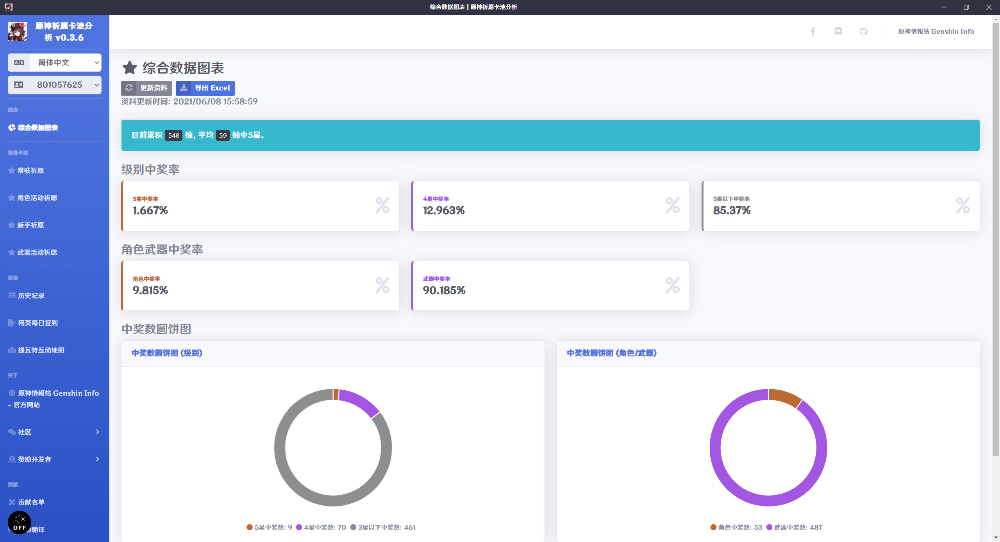
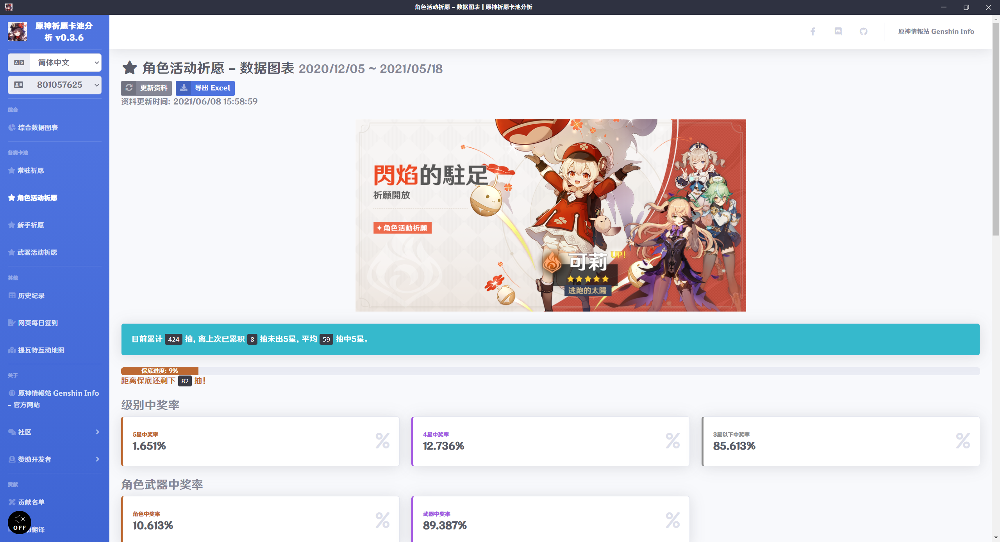
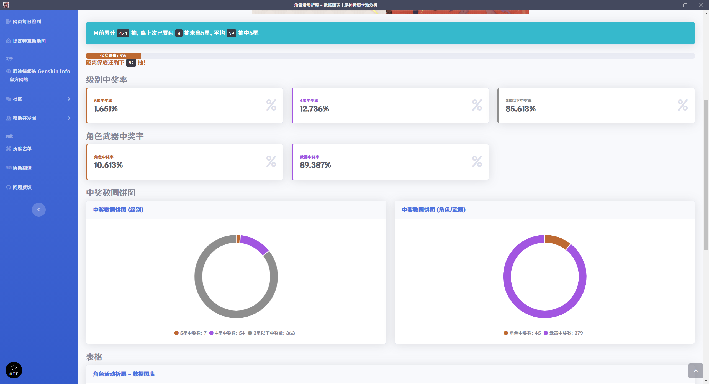
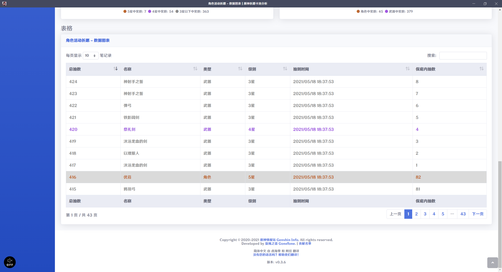
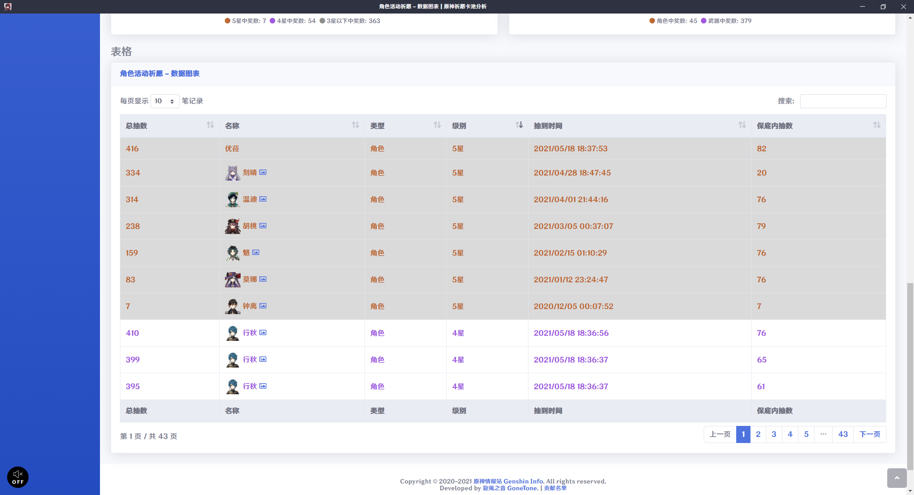
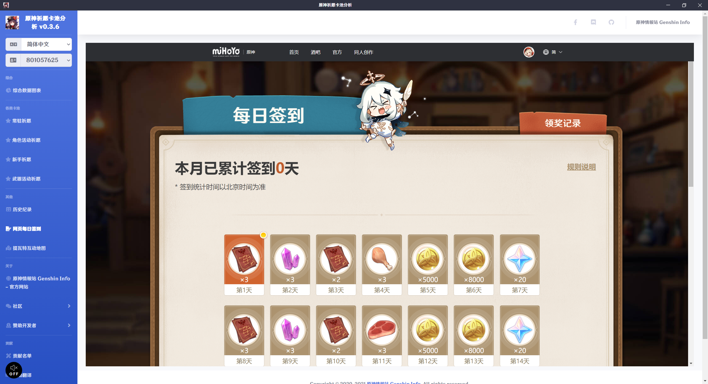
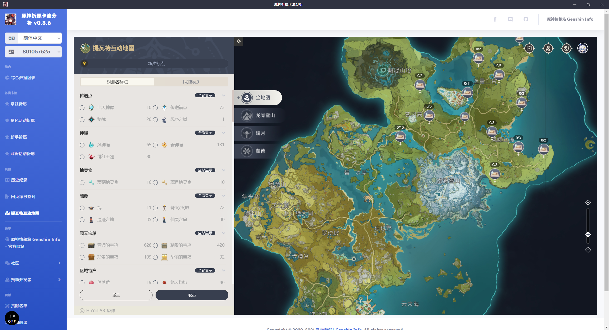

# 原神祈愿卡池分析 Genshin Impact Wish Gacha Analyzer

[繁體中文](README.md) | 简体中文 | [English](README_EN.md)

[](https://crowdin.com/project/genshin-impact-wish-gacha-analyzer)

我开发了一套用来分析祈愿卡池历史记录的软件，一开启各种数据清清楚楚，不用再手动计算啦！

本软件原理是按下「更新资料」后会在本机启动一个只跑在您电脑上的代理服务器，并自动安装一张本机生成的根证书，借此拦截原神 webview 对 miHoYo 卡池历史 API 的请求，所以要在按下更新后再到游戏内开启卡池历史记录才能拦到，取得网址后拆解参数，参数会用于 miHoYo 原神相关的 API。

第一次按下「更新资料」会加载您完整的卡池历史，这可能需要一些时间，完成后会将资料存放在您的电脑内，这样下次开启软件就不用再花时间等待资料加载。之后想取得新资料按一下「更新资料」即可，软件会记住先前拦到的网址，能用就直接用、不用每次重新拦截；如果网址过期，软件会请您再到游戏开一次卡池历史页面以重新取得网址。

请放心：本软件不会读取或窜改任何游戏文件、内存与游戏传输的数据，只会在 webview 开启卡池历史页面时拦下那一条请求网址，所以不会有被封锁帐号的风险。如果有被封号，请思考您是不是其他原因被封锁，不要怪罪我们。

帖子：
- 巴哈姆特：<https://forum.gamer.com.tw/C.php?bsn=36730&snA=11990&tnum=4>
- HoYoLAB：<https://www.hoyolab.com/genshin/article/552176>

## 多国语言

请协助我们将软件翻译成各国语言！

<https://crowdin.com/project/genshin-impact-wish-gacha-analyzer>

## 下载软件

软件在安装或运行时有可能会被防毒软件阻挡。原因是本软件会自行生成并安装一张本机根证书、并在按下更新时短暂设置系统代理以拦截原神 webview 的卡池历史请求——这类行为与恶意程序相似，但本软件只拦截 `*.hoyoverse.com/getGachaLog` 这一条 API，且证书只留在您的电脑。如果无法正常运行，请尝试关闭防毒软件后再运行看看，本软件保证无毒。

<https://github.com/GoneTone/genshin-impact-wish-gacha-analyzer/releases>

## 使用方式

1. 启动原神，先别开启卡池历史页面。
2. 开启本软件并按下「更新资料」，软件会在后台启动本机代理服务器并等候拦截。
3. 切回游戏，到「祈愿 → 历史记录」开启卡池历史页面。
4. 软件拦到网址后会自动关闭代理、还原系统代理设置并开始抓取资料；之后想再更新只要重复步骤 2，网址未过期就会直接套用。

## 功能和待做事项

- [x] 支持国际服
- [ ] 支持中国服
- [x] 总抽数统计
- [x] 中5星平均抽数统计
- [x] 保底进度条及剩余抽数统计
- [x] 级别中奖率和中奖数统计
- [x] 角色武器中奖率和中奖数统计
- [x] 级别中奖数圆饼图
- [x] 角色武器中奖数圆饼图
- [x] 历史记录 (官方 API 资料) 表单 (可自订排序及搜索)
- [x] 将抽卡记录导出 Excel
- [x] 依据玩家语言读取官方 API 取得相对语言资料
- [x] 版本更新通知
- [x] 多国语言 ([协助翻译](https://crowdin.com/project/genshin-impact-wish-gacha-analyzer))
- [x] 多帐号记录切换
- [ ] 记录和分析结果分享至线上
- [x] 深色浅色主题切换
- [x] 网页签到页面
- [x] 提瓦特互动地图
- [x] 资料更新不覆盖旧资料
- [x] 资料备份导出导入 (手动)

## 截图









## 开发

### 前置需求

- 目前仅支持 Windows
- [Flutter SDK](https://docs.flutter.dev/install)（最新稳定版）
- [Rust toolchain](https://rustup.rs/)（stable）
- 运行 `flutter doctor`，依提示补齐缺少的工具

### 取得源代码并安装依赖

```bash
git clone https://github.com/GoneTone/genshin-impact-wish-gacha-analyzer.git
cd genshin-impact-wish-gacha-analyzer
flutter pub get
cargo build --manifest-path rust/Cargo.toml
```

### 开发模式运行

```bash
flutter run -d windows
```

### Rust ↔ Dart 桥接代码生成

修改 `rust/src/api/` 内的 Rust 函数后，重新生成桥接代码。第一次使用前先安装 codegen 工具：

```bash
cargo install flutter_rust_bridge_codegen
```

之后每次修改 API 都运行：

```bash
flutter_rust_bridge_codegen generate
```

生成的文件位于 `lib/src/rust/`。

### 编译生产版

```bash
flutter build windows --release
```

输出：`build\windows\x64\runner\Release\`

### 运行测试

```bash
flutter test
cargo test --manifest-path rust/Cargo.toml
```
