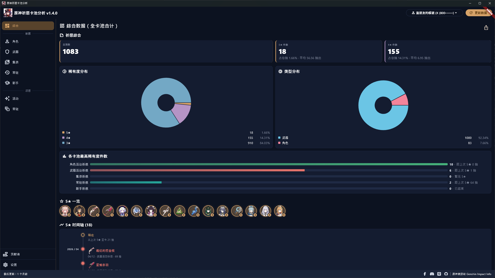
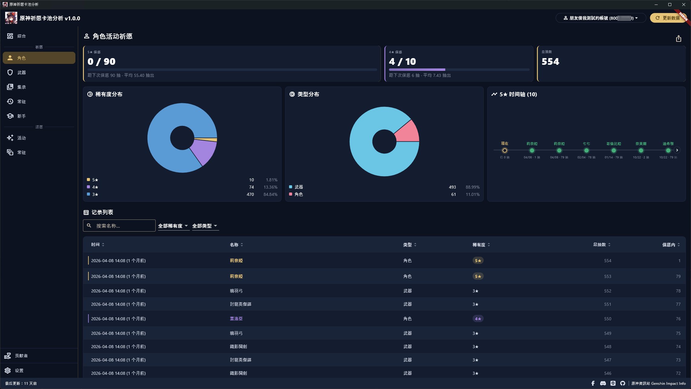
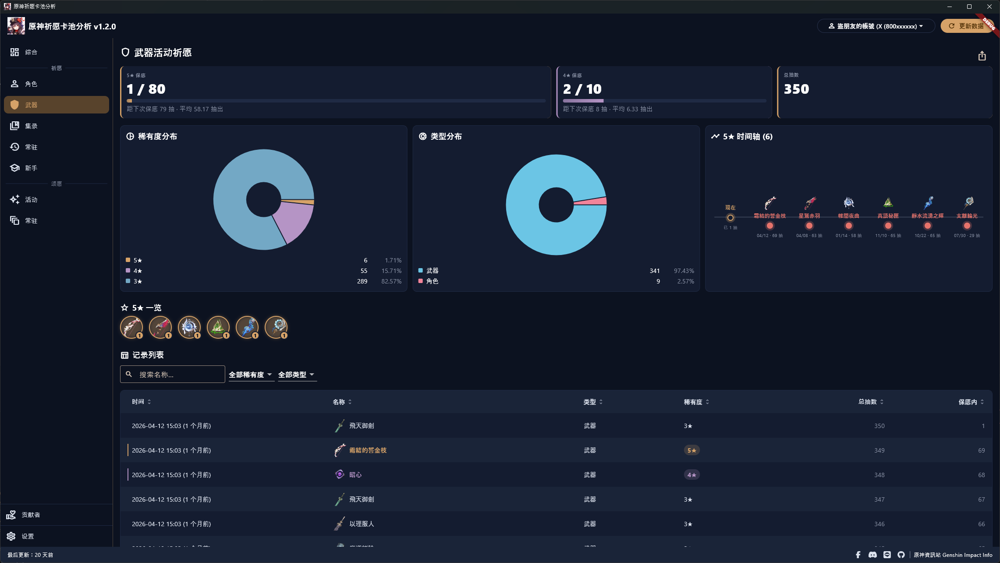
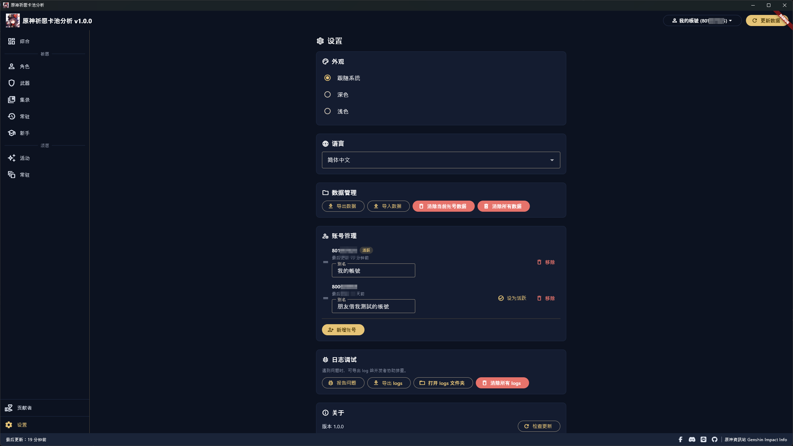
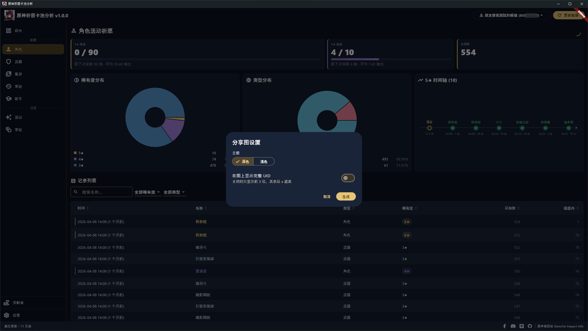

# 原神祈愿卡池分析 Genshin Impact Wish Gacha Analyzer

[繁體中文](README.md) | 简体中文 | [English](README_EN.md)

[](https://crowdin.com/project/genshin-impact-wish-gacha-analyzer)

我开发了一套用来分析祈愿卡池历史记录的软件，一打开各种数据清清楚楚，不用再手动计算啦！

本软件的原理是：按下「更新数据」后会在本机启动一个只跑在您电脑上的代理服务器，并自动安装一张本机生成的根证书，借此拦截原神 WebView 对 miHoYo 卡池历史 API 的请求，所以要在按下更新后再到游戏内打开卡池历史记录才能拦到，拿到网址后解析参数，参数会用于 miHoYo 原神相关的 API。

第一次按下「更新数据」会加载您完整的卡池历史，这可能需要一些时间，完成后会将数据保存在您的电脑上，这样下次打开软件就不用再花时间等待数据加载。之后想获取新数据按一下「更新数据」即可，软件会记住先前拦到的网址，能用就直接用、不用每次重新拦截；如果网址过期，软件会请您再到游戏打开一次卡池历史页面以重新获取网址。

请放心：本软件不会读取或篡改任何游戏文件、内存与游戏传输的数据，只会在 WebView 打开卡池历史页面时拦下那一条请求网址，所以不会有账号被封禁的风险。如果您被封号，请思考是否因为其他原因被封禁，不要怪我们。

帖子：
- 巴哈姆特：<https://forum.gamer.com.tw/C.php?bsn=36730&snA=11990&tnum=4>
- HoYoLAB：<https://www.hoyolab.com/genshin/article/552176>

## 多国语言

请帮我们将软件翻译成各国语言！

<https://crowdin.com/project/genshin-impact-wish-gacha-analyzer>

## 下载软件

软件在安装或运行时有可能会被杀毒软件拦截。原因是本软件会自行生成并安装一张本机根证书，并在按下更新时短暂设置系统代理以拦截原神 WebView 的卡池历史请求——这类行为与恶意程序相似，但本软件只拦截 `*.hoyoverse.com` 上的 `getGachaLog`（祈愿）与 `getBeyondGachaLog`（颂愿）这两条卡池历史 API，且证书只留在您的电脑上。如果无法正常运行，请尝试关闭杀毒软件后再运行试试，本软件保证无毒。

<https://github.com/GoneTone/genshin-impact-wish-gacha-analyzer/releases>

## 使用方法

1. 启动原神，先别打开卡池历史页面。
2. 打开本软件并按下「更新数据」，软件会在后台启动本机代理服务器并等候拦截。
3. 切回游戏，到「祈愿 → 历史记录」打开卡池历史页面。
4. 软件拦到网址后会自动关闭代理、还原系统代理设置并开始抓取数据；之后想再更新只要重复步骤 2，网址未过期就会直接使用。

## 功能与特色

- 自动拦截原神 WebView 对 miHoYo 卡池历史 API（通过本机代理服务器与自签根证书），无需手动粘贴网址
- 支持国际服（暂不支持国服）
- 涵盖 7 种卡池：角色活动祈愿、武器活动祈愿、集录祈愿、常驻祈愿、新手祈愿、活动颂愿、常驻颂愿
- 多账号 (UID) 管理：自定义别名、拖动排序、一键切换
- 自动合并新旧数据，不覆盖过往记录，不会因为官方历史记录过期而丢失
- 总抽数及 5★ / 4★ / 3★ / 2★ 数量与占比统计
- 5★ 与 4★ 双保底进度条，并显示距离保底的剩余抽数
- 各卡池 5★ 时间轴
- 各卡池最高稀有度数量对比柱状图
- 稀有度分布饼图
- 类型分布饼图
- 历史记录表格：多列排序、模糊搜索、稀有度与物品类型筛选、分页
- 账号数据导出 / 导入 JSON
- 深色 / 浅色主题切换
- 多国语言（[协助翻译](https://crowdin.com/project/genshin-impact-wish-gacha-analyzer)）
- 启动时自动检查新版本，也可在设置页手动触发
- 所有数据留在本机，不上传

## 截图








## 开发

### 前置需求

- 目前仅支持 Windows
- [Flutter SDK](https://docs.flutter.dev/install)（最新稳定版）
- [Rust toolchain](https://rustup.rs/)（stable）
- 运行 `flutter doctor`，根据提示补齐缺少的工具

### 获取源代码并安装依赖

```bash
git clone https://github.com/GoneTone/genshin-impact-wish-gacha-analyzer.git
cd genshin-impact-wish-gacha-analyzer
flutter pub get
cargo build --manifest-path rust/Cargo.toml
```

### 开发模式运行

```bash
flutter run -d windows
```

### Rust ↔ Dart 桥接代码生成

修改 `rust/src/api/` 内的 Rust 函数后，重新生成桥接代码。第一次使用前先安装 codegen 工具：

```bash
cargo install flutter_rust_bridge_codegen
```

之后每次修改 API 都运行：

```bash
flutter_rust_bridge_codegen generate
```

生成的文件位于 `lib/src/rust/`。

### 编译生产版

```bash
flutter build windows --release
```

输出：`build\windows\x64\runner\Release\`

### 运行测试

```bash
flutter test
cargo test --manifest-path rust/Cargo.toml
```
