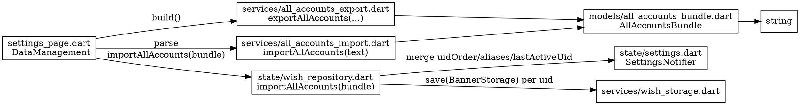

# Export / Import All Accounts — Design

**Date:** 2026-05-12
**Branch:** flutter-rewrite
**Status:** Approved (sections A–E confirmed by user)

## 1. Motivation & Goals

設定頁的「資料管理」目前以**單一帳號**為單位匯出（JSON / CSV）與匯入（JSON）。實務上使用者需要的多半是「**整機備份 / 換機搬遷**」——一次把所有帳號的卡池資料、別名、排序帶走。

### 目標

- 移除舊的單帳號功能：匯出 JSON、匯出 CSV、匯入 JSON
- 新增「匯出所有卡池資料」「匯入所有卡池資料」，產出 / 接受**單一 JSON 檔**
- 匯入時走「**Per-UID 覆蓋，其他保留**」策略，並顯示明確的衝突確認 dialog（型別輸入 `IMPORT`）
- 匯出檔的帳號排序須與設定一致（`mergeUidOrder` 結果），含 `alias`
- 同時還原 `lastActiveUid`，但**不**還原 `themeMode` / `locale`（避免跨機干擾 UI 偏好）

### 非目標

- 不打算保留 captured wishhistory URL（含 `authkey`，跨機共享意義小且潛在隱私顧慮）
- 不打算還原 `themeMode` / `locale`
- 不規劃部分匯出（單帳號的子集匯出）—— 一鍵全備份就夠
- 不規劃匯入時的衝突合併策略（不會嘗試「跟現有資料 union 紀錄」）—— 衝突一律覆蓋整個帳號

## 2. File Format (schema v1)

匯出檔為單一 JSON。**頂層 array 不行**：未來新增欄位（schema migration、metadata）難擴充，因此頂層用 object。

```json
{
  "schema_version": 1,
  "exported_at": "2026-05-12T08:30:00.000Z",
  "app_version": "x.y.z",
  "last_active_uid": "100000001",
  "accounts": [
    {
      "uid": "100000001",
      "alias": "主號",
      "last_updated": "2026-05-12T07:55:00.000Z",
      "banners": {
        "100": [/* WishRecord storage JSON */],
        "200": [],
        "301": [],
        "302": []
      }
    },
    {
      "uid": "100000002",
      "last_updated": "2026-05-11T20:11:00.000Z",
      "banners": { "100": [], "200": [], "301": [], "302": [] }
    }
  ]
}
```

### 欄位語意

| 欄位 | 必要 | 型別 | 說明 |
|------|------|------|------|
| `schema_version` | 是 | int | 目前固定 `1`。未來改格式時 +1 |
| `exported_at` | 是 | string (ISO 8601 UTC) | 匯出時刻；參考用，匯入流程不依賴 |
| `app_version` | 是 | string | 來自 `appVersionProvider`；失敗排查用 |
| `last_active_uid` | 否（可為 null）| string \| null | 匯出時的 active 帳號；匯入後也設成這個（若帳號存在於 `accounts` 中） |
| `accounts` | 是 | array | **順序 = 匯出時 `mergeUidOrder` 結果**；不可重複 UID |
| `accounts[].uid` | 是 | string | 帳號 UID |
| `accounts[].alias` | 否 | string | 別名；不存在或空字串 = 沒設別名 |
| `accounts[].last_updated` | 是 | string (ISO 8601 UTC) | 對應 `BannerStorage.lastUpdated` |
| `accounts[].banners` | 是 | object | key = gachaType，value = `WishRecord` 陣列；沿用既有 `BannerStorage.toJson` 內的 `banners` 結構 |

`accounts[]` 中**不再重複 `uid` 欄位於 banners 內部**，跟 `BannerStorage` 既有 storage 格式對齊：`BannerStorage.toJson()` 內就是 `{ uid, last_updated, banners }`，匯出檔每個 account 物件就是該 storage 物件的鏡像，再 inline 一個 `alias`。這讓 `Account.fromJson` 能直接呼叫 `BannerStorage.fromJson` 復用解析邏輯。

### 為什麼用 array 而非 map（uid → account）

- **排序資訊免另存**：array 順序就是 UI 顯示順序。匯出端：`accounts = mergeUidOrder(...).map(uid → buildAccount(uid))`
- 還原時讀 array 順序即可重建 `settings.uidOrder`

## 3. Architecture



### 元件邊界

每個檔案**單一職責**，公開介面窄到一行就能講完：

- **`models/all_accounts_bundle.dart`** — 純資料 + JSON codec。沒有 I/O、沒有 storage 依賴。可被任何層 import。
- **`services/all_accounts_export.dart`** — `String exportAllAccounts({...})`：給一組已建好的 `AllAccountsBundle`，回 pretty-printed JSON 字串。**不**做檔案 I/O；UI 層自己決定怎麼存。
- **`services/all_accounts_import.dart`** — `AllAccountsBundle importAllAccounts(String text)`：嚴格驗證 + 友善的 `FormatException`。**不**碰 storage / state。
- **`state/wish_repository.dart`** — 新方法 `importAllAccounts(AllAccountsBundle bundle)`：協調 storage 寫入、settings 合併、state 更新；唯一一個碰多個 subsystem 的地方。
- **`pages/settings_page.dart`** — UI：選檔、parse、顯示確認 dialog、呼叫 repository、SnackBar 結果。

把「parse」與「apply」拆兩段是因為**確認 dialog 要在 parse 完之後、apply 之前出現**（dialog 內要顯示衝突 UID 清單）。

## 4. Data Flow

### 匯出

1. `_DataManagement` 點「匯出全部」
2. 從 `wishRepositoryProvider` 取 `byUid`，從 `settingsProvider` 取 `uidOrder` / `uidAliases` / `lastActiveUid` / app version
3. 用 `mergeUidOrder` 算出 ordered uids
4. 組 `AllAccountsBundle`，呼叫 `exportAllAccounts(bundle)` 拿到 JSON string
5. `getSaveLocation` 預設檔名 `genshin_wish_backup_YYYY-MM-DD_HHmmss.json`
6. `File(path).writeAsString(...)`，SnackBar 顯示路徑

### 匯入

1. `_DataManagement` 點「匯入全部」
2. `openFile` 選 .json
3. `importAllAccounts(text)` parse → 拿到 `bundle` 或 `FormatException`（→ SnackBar）
4. **預驗證**：把所有 `accounts[].uid` 與現有 `wishState.byUid.keys` 交集找出衝突清單
5. 顯示 `showConfirmTypeDialog`：
   - 顯示「將匯入 N 個帳號 / M 筆紀錄」
   - 列出衝突 UID 清單（被覆蓋）
   - 指出未在匯出檔內的現有帳號**會保留**
   - 提示「此操作無法復原」
   - 要求輸入字串 `IMPORT` 確認
6. 確認後 `ref.read(wishRepositoryProvider.notifier).importAllAccounts(bundle)`
7. SnackBar：`已成功匯入 {accounts} 個帳號（{records} 筆紀錄）{failedSummary}`

### `WishRepository.importAllAccounts` 詳步

```dart
Future<ImportAllResult> importAllAccounts(AllAccountsBundle bundle) async {
  final storage = ref.read(wishStorageProvider);
  final settingsNotifier = ref.read(settingsProvider.notifier);

  final failed = <String>[]; // 寫入失敗的 UID
  final newByUid = Map<String, BannerStorage>.from(state.byUid);

  // 1. 逐帳號寫入 storage；單筆失敗不打斷整體
  for (final account in bundle.accounts) {
    try {
      final data = account.toBannerStorage();
      await storage.save(data);
      if (!ref.mounted) return _result(failed, partial: true);
      newByUid[account.uid] = data;
    } catch (e) {
      failed.add(account.uid);
    }
  }

  // 2. 合併 settings
  //    aliases: 用匯出檔內的覆蓋現有，未匯出 UID 的 alias 保留
  final mergedAliases =
      Map<String, String>.from(ref.read(settingsProvider).uidAliases);
  for (final acc in bundle.accounts) {
    if (failed.contains(acc.uid)) continue;
    final a = acc.alias?.trim();
    if (a == null || a.isEmpty) {
      mergedAliases.remove(acc.uid);
    } else {
      mergedAliases[acc.uid] = a;
    }
  }

  // 3. uidOrder: 匯出檔順序在前（過濾失敗者），現有 order 內剩下的 UID 接在後
  final exportedOrder = bundle.accounts
      .where((a) => !failed.contains(a.uid))
      .map((a) => a.uid)
      .toList();
  final exportedSet = exportedOrder.toSet();
  final remaining = ref.read(settingsProvider).uidOrder
      .where((u) => !exportedSet.contains(u))
      .toList();
  final newOrder = [...exportedOrder, ...remaining];

  // 4. lastActiveUid: 若匯出檔指定且成功寫入則切過去
  final desiredActive = bundle.lastActiveUid;
  final newActive = (desiredActive != null && newByUid.containsKey(desiredActive))
      ? desiredActive
      : (state.activeUid ?? (newByUid.isEmpty ? null : newOrder.first));

  // 5. 一次性 commit settings
  await settingsNotifier.applyImportedPreferences(
    aliases: mergedAliases,
    uidOrder: newOrder,
    lastActiveUid: newActive,
  );
  if (!ref.mounted) return _result(failed, partial: true);

  // 6. 更新 wish state
  state = state.copyWith(
    byUid: newByUid,
    activeUid: newActive,
  );

  return _result(failed, partial: false);
}
```

`SettingsNotifier.applyImportedPreferences` 為新增方法，把三個欄位一次性原子更新（避免 import 中途多次 `SettingsStorage.save` 寫盤）。

## 5. Error Handling

### Parse phase（`importAllAccounts(text)`）

| 條件 | 處理 |
|------|------|
| JSON 語法錯 | `FormatException('Invalid JSON')` |
| 頂層非 object | `FormatException('Top-level value must be an object')` |
| `schema_version` 不存在或非 int | `FormatException('Missing schema_version')` |
| `schema_version` > 1 | `FormatException('Unsupported schema version: $v. Please update the app.')` |
| `accounts` 不存在或非 array | `FormatException('Missing accounts array')` |
| `accounts` 內 UID 重複 | `FormatException('Duplicate UID in accounts: $uid')` |
| 單個 account 內 `BannerStorage.fromJson` 失敗 | `FormatException('Account[$i]: ${e.message}')` |

對 `app_version`、`exported_at` **不**做驗證（這些只是 metadata，舊版可能沒有；若無/錯就忽略）。

### Apply phase（`WishRepository.importAllAccounts`）

- 任一 `storage.save` 失敗：該 UID 加入 `failed`，**繼續**處理下一筆（部分匯入）
- `failed` 內的 UID **不**會進入 `byUid`，**不**會更新其 alias，**不**會出現在新 `uidOrder` 內
- 結果 `ImportAllResult { totalAccounts, totalRecords, failedUids }` 給 UI 顯示

### UI

- Parse 失敗：SnackBar `匯入失敗：{reason}`
- 全成功：SnackBar `已成功匯入 {accounts} 個帳號（{records} 筆紀錄）`
- 部分成功：SnackBar `已匯入 {success}/{total} 個帳號；失敗：{failedUids}`

## 6. UI Changes

### `_DataManagement` 按鈕

```
Before                 After
─────────────          ─────────────
匯出 JSON              匯出全部
匯出 CSV               匯入全部
匯入 JSON              清除目前帳號資料
清除目前帳號資料        清除所有資料
清除所有資料
```

### 確認 dialog 內容（範本）

```
標題：匯入確認

即將匯入 2 個帳號（共 1234 筆紀錄）：
  • 100000001（主號）— 800 筆
  • 100000002 — 434 筆

下列 UID 已有資料，將被覆蓋：
  • 100000001

其他現有帳號（100000003）將保留。
此操作無法復原。請輸入 IMPORT 以確認。
```

衝突列表為 0 時：「無資料衝突」一行帶過，仍保留 `IMPORT` 確認（操作仍不可逆，行為一致）。

## 7. l10n

### 移除

- `settingsExportJson`
- `settingsExportCsv`
- `settingsImportJson`
- `settingsExportSuccess`
- `settingsImportSuccess`
- `settingsImportFailed`

### 新增

| key | 繁中範本 |
|---|---|
| `settingsExportAll` | 匯出全部資料 |
| `settingsImportAll` | 匯入全部資料 |
| `settingsExportAllSuccess(path)` | 已匯出至 {path} |
| `settingsImportConfirmTitle` | 匯入確認 |
| `settingsImportConfirmIntro(accounts, records)` | 即將匯入 {accounts} 個帳號（共 {records} 筆紀錄）： |
| `settingsImportConfirmOverwriteHeader` | 下列 UID 已有資料，將被覆蓋： |
| `settingsImportConfirmNoConflict` | 無資料衝突。 |
| `settingsImportConfirmPreserveFooter(uids)` | 其他現有帳號（{uids}）將保留。 |
| `settingsImportConfirmWarning` | 此操作無法復原。請輸入 IMPORT 以確認。 |
| `settingsImportAllSuccess(accounts, records)` | 已成功匯入 {accounts} 個帳號（{records} 筆紀錄） |
| `settingsImportAllPartial(success, total, failedUids)` | 已匯入 {success}/{total} 個帳號；失敗：{failedUids} |
| `settingsImportAllFailed(reason)` | 匯入失敗：{reason} |

繁中（`app_zh_Hant.arb`）與英文（`app_en.arb`）全補；其他語系本次先複製英文，註明待翻譯（與專案既有 i18n flow 一致）。

## 8. Testing

### 新增測試

1. `test/models/all_accounts_bundle_test.dart`
   - `toJson` / `fromJson` roundtrip
   - 缺欄位、錯型別 → `FormatException`
   - schema_version 大於 1 → 錯誤訊息含「update the app」
   - 重複 UID 拋錯
   - `alias` 缺省 / 空字串都當作沒設

2. `test/services/all_accounts_export_test.dart`
   - 給定 `byUid` + `uidOrder` + aliases，輸出的 `accounts[].uid` 順序等於 `mergeUidOrder(...)`
   - `alias` 正確內嵌
   - `last_active_uid` 帶出
   - JSON 是 pretty-printed（兩格）

3. `test/services/all_accounts_import_test.dart`
   - 合法檔成功 parse
   - 所有錯誤 case 拋 `FormatException` 且訊息可讀

4. `test/state/wish_repository_test.dart`（新增 cases）
   - per-UID 覆蓋：匯入 [A, B] 到既有 {A, C} → 結果 {A=匯出, B=匯出, C=保留}
   - aliases 合併：匯入端有 A=主號、現有 C=另一支 → 結果 A=主號、C=另一支
   - `uidOrder`：匯出順序在前，未匯出的保留尾段相對順序
   - `lastActiveUid`：採匯出檔指定值（若仍存在）
   - 部分失敗：模擬 storage.save 對 B 拋錯 → A 成功、B 在 failed list、`uidOrder` 不含 B

5. `test/state/settings_test.dart`：`applyImportedPreferences` 一次更新三欄位且只呼叫一次 `SettingsStorage.save`

### 維持 / 刪除

- 刪除 `test/services/data_export_test.dart` 內 csv / json export 測項；若整檔僅這些，整檔刪除
- 刪除 data_import 對應測項

## 9. YAGNI Notes

明確**不做**：

- 不寫匯入時的「dry-run」preview 解析摘要 widget；確認 dialog 用一段文字即可
- 不寫 schema migration framework；目前只 v1，新版來再加
- 不寫匯出進度條（檔案小、寫入快）
- 不寫匯出加密 / 密碼保護
- 不在匯出檔內保留 captured URL（含 authkey，跨機共享 = 額外風險）
- 不在匯入後重新觸發 `update()`；使用者自行決定

## 10. Migration / Backwards Compat

- 舊單帳號 export JSON 檔**無法**透過新匯入流程匯入（schema 不同）
- 因此**保留** `BannerStorage.fromJson` 不變（其他 storage 流程仍在用）；新 import 走 `AllAccountsBundle.fromJson`，內部仍委派 `BannerStorage.fromJson` 解析每個 account 的 banner 結構
- 若使用者要遷移舊匯出檔：本次**不**提供 UI 入口（YAGNI，社群可手動 wrap）

## 11. Open Decisions（已敲定）

- A 檔案結構：array + inline alias ✅
- B 排序策略：匯出檔優先 ✅
- C 確認 dialog：輸入 `IMPORT` ✅
- E 失敗模式：部分匯入 ✅
